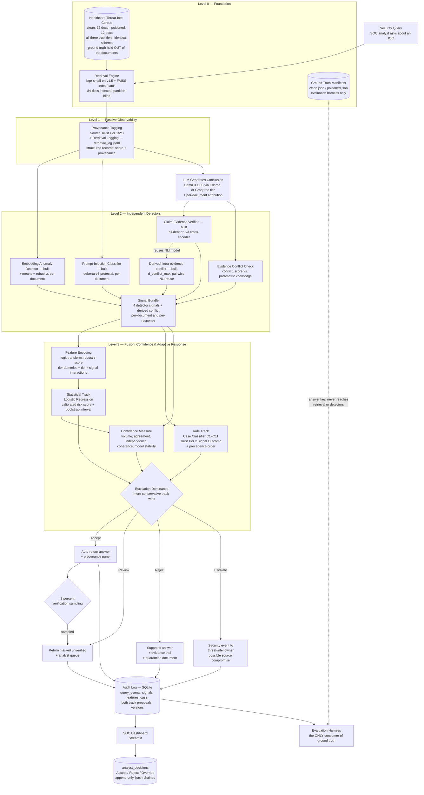

# Hallucinations in AI-Driven Cybersecurity Systems: A Healthcare Sector Perspective

**Team Zetabyte** — Deloitte Capstone Programme 2026, Manipal University Jaipur

A trust-and-risk layer for healthcare threat-intelligence RAG pipelines, built to detect
**attacker-induced** hallucination — corpus poisoning engineered to make a security
assistant confidently produce a specific wrong conclusion — and to distinguish it from an
honest mistake.

> **📄 [`docs/PROJECT_REPORT.md`](docs/PROJECT_REPORT.md)** — the comprehensive report:
> every design decision with its rationale, full implementation detail, the decision log,
> known limitations, and the architecture figures. Start there for the complete picture.
>
> **📐 [`docs/design/TRUST_RISK_DESIGN.md`](docs/design/TRUST_RISK_DESIGN.md)** — the
> authoritative specification (`design-v1.1`) for case definitions, feature encoding,
> thresholds and the audit schema.

### Status

| Component | State |
|---|---|
| Decision-logic design (`design-v1.1`) | ✅ Complete, authoritative |
| Corpus — 72 clean + 12 poisoned, all three trust tiers | ✅ Built, validated, 0 errors |
| Baseline RAG pipeline (control condition) | ✅ Built, 45 checks passing |
| Level 2 detectors (3 + 1 derived) | ✅ Built, 20 checks passing |
| Level 3 fusion and case classifier | 📐 Designed, not implemented |
| Report generator · dashboard · audit log | 📐 Designed, not implemented |
| Evaluation harness | ⬜ Not started |

All measured figures to date are **provisional**: no development environment could reach
PyPI or Hugging Face, so results used fallback backends. Structure and direction are
verified; performance is not yet measured.

### Quick start

```bash
pip install -r requirements.txt
export GROQ_API_KEY=...                  # free key: https://console.groq.com

python corpus/build_clean_corpus.py    --ingestion-date 2026-09-02 --clean
python corpus/build_poisoned_corpus.py --ingestion-date 2026-09-03 --clean
python corpus/validate_corpus.py --corpus clean    --strict
python corpus/validate_corpus.py --corpus poisoned --strict

python -m pipeline.check_backends        # verify models and API access
python -m pipeline.build_index
python -m pipeline.test_pipeline
python -m detectors.test_detectors -v
```

---

## 1. Problem Statement

Healthcare organizations are increasingly deploying LLM + Retrieval-Augmented Generation (RAG) systems to triage threat intelligence, summarize security advisories, and support SOC (Security Operations Center) analysts. These systems retrieve evidence from a knowledge base and generate a conclusion — e.g., "Is this IP associated with known ransomware infrastructure?"

This introduces a security-specific failure mode that generic AI hallucination research does not address: **an attacker can deliberately poison the retrieval corpus to make the model confidently generate a specific false conclusion.** This is different from an ordinary hallucination (the model making an unforced factual error). It is an *engineered* failure, and in a healthcare-cybersecurity context — where a wrong SOC conclusion can mean a missed ransomware indicator, a misclassified breach, or a delayed clinical-system lockdown — the cost of not detecting it is severe.

Existing hallucination-mitigation tools (Galileo, Cleanlab, Ragas, Guardrails AI, etc.) treat hallucination as a data-quality problem: *did the model make something up?* None of them are built to answer the security question: *did an adversary engineer the retrieval context to produce this specific wrong answer, and can the system tell the difference from an honest mistake?*

**That gap — attack-induced vs. ordinary hallucination, in a healthcare threat-intelligence RAG pipeline — is the problem this project solves.**

The system additionally distinguishes two further failure modes that a purely factuality-oriented tool conflates with poisoning: a **trusted source behaving anomalously** (which may indicate compromise of the source itself rather than of this query) and **two authoritative sources contradicting each other** (which is usually a legitimate advisory revision, not an attack at all).

---

## 2. Our Solution

We propose a **trust-and-risk layer that sits between retrieval and generation** in a healthcare-sector security RAG pipeline. Instead of trusting retrieved evidence and generated conclusions by default, the system:

1. Tags and monitors the provenance and retrieval behavior of every piece of evidence
2. Runs independent, lightweight detectors for the most common attack surfaces (poisoned embeddings, prompt injection, evidence conflict, unsupported claims)
3. Classifies the situation into a named case and, in parallel, fuses the detector signals into a fitted composite risk score with an accompanying confidence measure
4. Escalates only the high-risk cases for deeper checking or human review — instead of running expensive verification on every single query
5. Records the analyst's disposition of every flagged case in a tamper-evident audit trail

This is a **defense-in-depth, risk-adaptive** design: no single detector is trusted alone, and computational cost is spent only where risk is highest. This isn't our opinion — it's the consistent conclusion across all seven papers we reviewed (see [Section 11](#11-key-findings-from-the-literature)).

---

## 3. Why This Is a Real Problem (Not a Toy Exercise)

- **PoisonedRAG** (USENIX Security 2025) empirically demonstrated that a small number of carefully crafted documents can manipulate a RAG system into attacker-chosen answers — this is a peer-reviewed, reproducible attack, not a hypothetical.
- **TrustRAG** (arXiv 2025) exists specifically because production RAG systems have no built-in defense against this; it had to be built as a bolt-on layer.
- Commercial RAG-evaluation tools (Galileo, Arize Phoenix, Cleanlab, Patronus, Ragas) are a fast-growing category — proof the market takes RAG trust seriously — but every one of them evaluates *factuality*, not *adversarial intent*. We found no existing system that frames hallucination detection as a security problem specifically for healthcare threat intelligence.
- Healthcare is a uniquely high-stakes sector for this: AI-assisted SOC tools are being adopted faster than their trust infrastructure is maturing, and a poisoned conclusion here has downstream clinical and operational consequences, not just an embarrassing wrong answer.

**This is where our novelty sits:** not inventing a new detection technique, but being the first (to our research) to combine existing RAG-security techniques into a system explicitly framed around attacker-induced hallucination in a healthcare cybersecurity context.

---

## 4. Architecture (Level 0 → Level 3)

We organized every finding from the seven papers into five difficulty levels (Level 0 = foundation, Level 5 = full agentic system). **This capstone builds Levels 0–3.** Full breakdown below.



### Component breakdown

| Level | Component | What it does | Source papers |
|---|---|---|---|
| L0 | RAG baseline | Retrieve → generate, no security layer. `pipeline/` — bge-small-en-v1.5 embeddings, FAISS flat index, Ollama or Groq generation. The control condition the trust layer is measured against | Baseline across all papers |
| L0 | Clean corpus | 72 healthcare threat-intel documents spanning all three source trust tiers, deterministically assembled and validated before downstream use | Section 6 |
| L0 | Poisoned corpus | 12 adversarial documents built using PoisonedRAG's S+I construction across six attack families and all three trust tiers, rendered by the clean corpus's own renderers so structure carries no signal | P5 |
| L0 | Ground-truth manifests | Clean/poisoned labels held outside the document files; the evaluation harness is their only consumer | Section 6 |
| L1 | Source provenance tagging | Every doc gets a source ID + Source Trust Tier (1/2/3), assigned at ingestion and never modified by detector output | P2, P4, P6 |
| L1 | Retrieval logging | Every query and its retrieved records — similarity, full provenance, set-level geometry — appended to `logs/retrieval_log.jsonl`. Passive only: no scoring, filtering or flagging | P1, P5, P6 |
| L1 | Perplexity | **Not computed anywhere.** Scoped out on the literature review: clean and adversarial text overlap in perplexity, and no perplexity term appears in the composite score. A test asserts it never reaches a log record | P1, P5 |
| L2 | Embedding anomaly detection | `detectors/anomaly.py` — k-means over the retrieval set, robust median/MAD z-score per document. Expected to be the *weakest* of the three: PoisonedRAG documents are built to sit near the query | P1 (TrustRAG), P4, P5 |
| L2 | Prompt-injection classifier | `detectors/injection.py` — `protectai/deberta-v3-base-prompt-injection-v2`, positive class resolved by label name | P4, P6, P7 |
| L2 | Claim-evidence verification | `detectors/entailment.py` — `cross-encoder/nli-deberta-v3-base`. The one signal where higher = safer — **our core differentiator** | P3, P5 |
| L2 | Evidence conflict resolution | Compares retrieved evidence against the LLM's own internal knowledge; flags disagreement | P1, P3 |
| L2 | Intra-evidence conflict (derived) | `detectors/entailment.py` — pairwise contradiction reusing the NLI model. `tier1_conflict_max` is the quantity case C10 turns on | P1, P3 |
| L3 | Case classifier (rule track) | Assigns one of eleven named cases by crossing Source Trust Tier with Content Signal Outcome, under a fixed precedence order | Design §2 |
| L3 | Composite risk score (statistical track) | Fitted logistic regression over the four signals, tier dummies and tier×signal interactions — not a hand-picked weighted sum | Supported across all 7 papers |
| L3 | Confidence measure | Five-component geometric composite reported alongside the risk score, never folded into it | Design §4 |
| L3 | Risk-adaptive escalation | Accept / Review / Reject / Escalate, reconciled between the two tracks by escalation dominance | P1, P4, P6 |
| L3 | Audit log | Every query, evidence set, signal, feature vector, case, both track proposals, and version stamp recorded | P3, P6 |
| L3 | Analyst decision capture | Append-only, hash-chained record of every analyst disposition, with controlled-vocabulary override reasons | P3, P6 |

---

## 5. Decision Logic

The full specification lives in [`docs/design/TRUST_RISK_DESIGN.md`](docs/design/TRUST_RISK_DESIGN.md), which is the authoritative source for case definitions, feature encoding, thresholds and schema. The summary below is orientation only.

### 5.1 Four separate outputs, not one number

For every query the layer produces a **case**, a **risk score**, a **confidence value**, and — once an analyst acts — a **decision record**. These are kept distinct because a high-risk finding backed by five independent corroborating documents and a high-risk guess drawn from a single document require different human responses, and a single scalar cannot express the difference.

### 5.2 Two tracks, reconciled conservatively

A **rule track** (the case taxonomy) and a **statistical track** (the fitted score) run over the same inputs. The final disposition is the more conservative of the two proposals, on the ordering `Accept < Review < Reject < Escalate`. This guarantees the statistical track can never make the system less safe than the rules alone, and the disagreement rate between the two is itself a reported evaluation result.

Only the rule track can produce **Escalate**, because escalation is a claim about the *system* rather than about the answer, and that requires the semantic structure of a case rather than a scalar.

### 5.3 Case taxonomy

Eleven cases cross Source Trust Tier (1/2/3) with Content Signal Outcome (Clean/Suspicious/Malicious). Signal band thresholds are set as quantiles of the clean-only calibration distribution, so the false-positive rate is designed in rather than discovered. Two cases carry the taxonomy's principal claims:

- **Anomalous behaviour from a Tier 1 source is higher priority than malicious content from Tier 3.** The tier is a prior; an anomaly that is improbable under that prior carries more information, has a far larger blast radius because everything downstream trusts Tier 1 by default, and admits only serious explanations — source compromise, interception of the fetch path, provenance mislabelling, or insider modification. Each is a finding about the system, not the query, so the action is **Escalate**, not Reject.
- **Two Tier 1 sources contradicting each other is a distinct failure mode, not poisoning.** It is characterised by high inter-document contradiction with quiet attack indicators, and is usually advisory revision, scope difference, or genuine analytic disagreement. The system is bound never to silently pick a winner; the response is a dual-evidence presentation with both claims, sources and dates.

### 5.4 Scoring

Logistic regression fitted on the labelled corpus. Bounded signals are logit-transformed; the anomaly distance is robustly normalised within each query's own retrieval set. **Source tier is dummy-coded, never ordinal** — an ordinal encoding would force a monotone relationship and make the Tier-1 inversion structurally unlearnable — and **tier × signal interaction terms** are what allow the model to represent "an anomaly means more from Tier 1."

Evaluation follows from one stated assumption, that a missed attack costs roughly ten times a false alarm: PR-AUC for model selection, F₃ as the headline scalar, and recall at a fixed alert budget as the operating metric. Data is split by attack template rather than at random, with a locked test set, nested cross-validation, and a leave-one-attack-family-out evaluation that measures generalisation to unseen attack strategies. Precision is additionally reported corrected to realistic deployment prevalence.

### 5.5 Confidence

Five components — evidence volume, evidence agreement, source independence, detector coherence, and model stability under bootstrap — combined by geometric mean so that one weak component drags the composite down. A single-document answer is hard-capped and can never be high confidence. Low confidence widens the risk interval and pushes borderline cases toward Review; it can never downgrade a disposition. The measure carries its own falsification test: high-confidence predictions must demonstrably err less often than low-confidence ones, or the weights are refitted and failing components dropped.

### 5.6 Audit trail

`query_events` records every signal, the encoded feature vector, both track proposals, the final action and a full version stamp. `analyst_decisions` records the human disposition as **Accept / Reject / Override** — always a judgement about the content, with `Override` reserved for disagreement with the system's recommendation — plus a controlled-vocabulary reason code, per-document verdicts, and decision latency. The table is append-only and hash-chained; corrections supersede rather than modify. A random 3% of auto-accepted responses is routed for blind analyst review so that future recalibration is not restricted to cases the current system already flags.

The field is **never auto-populated.** It is written only as the direct result of a human acting
in the dashboard: there is no default, no code path in the pipeline that sets it, and no timeout
that ages an unreviewed case into `Accept`. An unreviewed event is represented by the *absence of
a row* rather than by a `NULL` or a `PENDING` sentinel, so the undecided state cannot be confused
with a verdict. Three independent layers enforce this — a `NOT NULL` column with no `DEFAULT`,
separation of the write path from the scoring pipeline, and a `decision_source` provenance column
that excludes any non-analyst row from recalibration by default.

Two SQL views (`v_current_decisions`, `v_labelled_decisions`) are the sanctioned extraction
surface for a future recalibration pass, resolving supersede chains and the analyst-only filter
once rather than in every query. A trap worth knowing: a response-level `Reject` is *not* the risk
model's target — an analyst rejects answers for staleness and weak support as well as for
poisoning — so per-document verdicts, not response-level decisions, are the preferred label
source.

---

## 6. Corpus

Full detail in [`corpus/README.md`](corpus/README.md). The clean partition is built and
validated; the poisoned partition is not yet constructed.

### 6.1 Composition of the clean corpus

72 documents, deliberately spread across all three source trust tiers.

| Tier | Sources | Count |
|---|---|---|
| **1** — verified / authoritative | CISA ICS Medical Advisories (8), CISA Cybersecurity Advisories (7), MITRE ATT&CK techniques (12), NVD CVE records (7), HHS HC3 briefs (4), vendor PSIRT bulletins (2) | **40** |
| **2** — trusted but open | Health-ISAC member bulletins (6), security vendor research (7), curated OSINT feeds (8) | **21** |
| **3** — unverified / unknown | unattributed reports (4), community forum threads (4), uploaded analyst notes (3) | **11** |

Tier 2 and Tier 3 documents are present by necessity, not for variety. Four of the eleven
cases in the taxonomy are defined at those tiers, and signal band thresholds are calibrated
*per tier* from clean data — with no clean Tier 2 or Tier 3 documents there is no reference
distribution against which an anomaly at those tiers could be judged.

**A Tier 3 document is not a malicious document.** Source trust and content integrity are
separate axes, which is why the taxonomy crosses them. All Tier 3 documents in the clean
partition are clean, and they populate case C3, "Unverified but Unremarkable".

### 6.2 Provenance

Every document body is authored for this benchmark and labelled
`content_origin: synthesized_representative`. Bodies reproduce the structure, register and
field conventions of the source type they model; none is a copy of a published advisory.

27 of the 72 documents are anchored to **verified public identifiers** — 8 CISA medical
advisory IDs, 12 MITRE ATT&CK technique IDs, 7 CVE records — each with its canonical URL and
flagged `reference_verified: true`. That flag attests to the identifier and title, and makes
no claim about the body text. All network indicators are fabricated and drawn from ranges
reserved for documentation.

This is a deliberate design property rather than a limitation of what could be fetched. It
keeps the artifact honest under examination, avoids redistributing licensed third-party
content, and lets the corpus stay fixed while the advisories it models continue to change.

### 6.3 The poisoned partition

12 adversarial documents built following the PoisonedRAG methodology (P5), as **defensive
security research**: synthetic, every assertion deliberately false, all indicators drawn from
ranges reserved for documentation, never inserted into any live retrieval system and never
directed at any third-party system. They exist to provide ground-truth positives for
evaluating this project's own detection layer.

| Attack family | Count | What it does |
|---|---|---|
| `ioc_reputation_flip` | 3 | Asserts a known-malicious indicator is benign, or that a listing was withdrawn |
| `authority_spoof` | 2 | Impersonates a Tier 1 channel — an advisory "update" reversing isolation guidance |
| `severity_downgrade` | 2 | Concedes the vulnerability but understates reachability so remediation is deprioritised |
| `remediation_misdirection` | 2 | Concedes the finding but recommends an action that weakens the defensive position |
| `attribution_fabrication` | 2 | Invents confident attribution that displaces defensive effort |
| `direct_prompt_injection` | 1 | Embeds instruction text addressed to the generating model rather than a human reader |

Tier distribution is 2 / 5 / 5. The two Tier-1 documents simulate a **compromised
authoritative channel** — a spoofed advisory update declaring a dangerous device safe to
reconnect, and a bulletin claiming exposed key material was silently rotated, both
instructing removal of the compensating controls actually holding the risk down. These are
the cases the taxonomy ranks highest (C4/C5), and without them that claim cannot be validated
at all. Six families exist because leave-one-attack-family-out (§5.4) withholds an entire
family to measure generalisation to unseen attacks.

**Construction (S + I).** Each document pairs a retrieval-optimising segment `S`, generated
from the target query since the black-box attacker cannot probe the embedding model, with a
corruption payload `I` carrying the intended false conclusion. `S` restates the query as a
natural subject line rather than pasting it verbatim, which would be detectable by
inspection. A BM25 pre-check ranks all 12 first or second against the whole clean corpus for
their target queries — a **pre-check, not verification**, since pipeline retrieval is dense
rather than lexical.

### 6.4 Ground truth is held outside the documents

**The clean/poisoned label is not stored in any document file.** It lives in
`corpus/ground_truth/<partition>.json`, and the validator fails any document carrying an
answer-key field.

A document file is what the retrieval pipeline loads. A label inside it is reachable by the
detection layer through any code path that touches the document dict, and the leak need not
be deliberate — a field populated on poisoned documents and null on clean ones is a perfect
classifier available for free. The subtler half is **schema symmetry**: removing the label is
not enough if the shape of the record still separates the partitions, so the validator
compares key sets across partitions and errors on any difference.

For the same reason, poisoned documents are rendered by the **clean corpus's own renderers**,
imported directly. Separate rendering code would give the poisoned partition a stylistic
signature, and the detectors would learn the signature rather than the attack.

### 6.5 Build and validation

The build is **deterministic** — identical inputs produce byte-identical output, and the
network is never touched during a build. A corpus that varies between runs cannot support
reproducible evaluation.

```bash
cd corpus
python build_clean_corpus.py    --ingestion-date 2026-09-02 --clean
python build_poisoned_corpus.py --ingestion-date 2026-09-03 --clean \
       --retrieval-report ../eval/poison_retrieval_check.json
python validate_corpus.py --corpus clean    --strict --report ../eval/corpus_validation_clean.json
python validate_corpus.py --corpus poisoned --strict --report ../eval/corpus_validation_poisoned.json
```

`validate_corpus.py` must pass before any embedding, retrieval or scoring work. Corpus
faults do not fail loudly downstream; they quietly distort a metric. Beyond field
completeness, date validity, identifier uniqueness, index agreement and checksum integrity,
three checks carry the weight:

- **Tier agreement with the source registry.** Tier is assigned in exactly one place and
  documents inherit it from their source. A document whose tier has drifted is rejected,
  because tier is the foundation of the case taxonomy — a wrong tier silently corrupts every
  case assignment and every per-tier threshold derived from it. This is the corpus-side
  counterpart of the `TIER_MISLABELLED` override reason code.
- **Tier coverage.** Error if any tier is empty; warning if a tier is too thin for stable
  per-tier quantile thresholds.
- **Near-duplicate detection.** Documents rendered from shared templates cluster tightly in
  embedding space and would hand the Level 2 anomaly detector an artificially clean baseline —
  an evaluation artifact presented as a result. The builder varies phrasing per document and
  the validator measures whether that worked. Current maximum pairwise Jaccard overlap is
  **0.34** clean / **0.20** poisoned, against a 0.70 warning threshold.
- **Benchmark validity.** No document may carry an answer-key field; clean and poisoned
  documents must expose identical key sets; the ground-truth manifest must label exactly its
  partition's documents; and every poisoned document must name a `poison_family_id` and a
  `target_query_id`, with at least three families and at least one Tier-1 poisoned document
  present.

The validator was itself tested against seven deliberately injected faults (wrong tier,
tampered content, missing field, uncitable verified reference, missing index entry,
impossible date, clean document tagged as poisoned) and detected all seven.

### 6.6 A naming distinction that matters downstream

The design document calls the per-document grouping key `source_doc_id`; in the corpus it is
`doc_id`. `source_id` is a different field identifying the publishing feed, shared across
many documents. **Grouped splitting must group by `doc_id`** — grouping by `source_id` would
place all 12 MITRE ATT&CK documents in one group and collapse the split.

---

## 7. Baseline Pipeline

Full detail in [`pipeline/README.md`](pipeline/README.md). This is the **control
condition**: retrieve → generate → log, with no security layer at all. Everything built
afterwards is measured against it, so it stays naive by design — no provenance weighting,
no filtering, no refusal behaviour, and no trust language in the prompt.

```bash
pip install -r pipeline/requirements.txt
python -m pipeline.build_index
python -m pipeline.run_query "Is 198.51.100.47 associated with ransomware infrastructure?"
python -m pipeline.test_pipeline
```

### 7.1 Three independently callable stages

| Function | Returns |
|---|---|
| `embed_query(query)` | L2-normalised vector |
| `retrieve_top_k(query, k=5)` | `RetrievalResult` — `.records` is a list of `RetrievedRecord` |
| `generate_answer(query, retrieved_docs)` | `GenerationResult` |

Separate on purpose: later instrumentation needs retrieval without generation (to compute
detector signals over a retrieval set) and generation without re-retrieval (to replay a
logged set).

### 7.2 Retrieval returns structured records, not strings

Each record carries its rank and **similarity score**, the document text, and full
**provenance** — `source_id`, `source_tier`, tier label, source type, publisher,
publication date, verification status, content hash — plus tags, CVE IDs and ATT&CK
techniques. `RetrievalResult` adds the set-level geometry (`n_retrieved`, similarity
spread, `tier_min`, `top_tier`) that the anomaly detector and confidence measure need.

The report generator, the audit log and all four detectors read these fields. Returning
text alone would force each of them to re-fetch metadata independently and drift apart in
how they did it.

**`top_tier` is not `tier_governing`.** The latter is the tier of the highest-*attribution*
cited document (§5.3), which needs the generation step. `top_tier` is the retrieval-time
approximation; the fusion layer recomputes it.

### 7.3 Passive retrieval logging (Level 1)

Every query and everything it retrieved, with scores and provenance, is appended to
`logs/retrieval_log.jsonl` — one line per query, flushed and `fsync`ed so a crash cannot
lose the record of what the pipeline saw. Nothing is scored, filtered or flagged.

JSONL rather than the SQLite `query_events` table (§5.6) because that table carries
detector signals and case identifiers that do not exist yet; writing rows with those
columns null would give the audit trail a large block of meaningless history. Each line
carries a schema version so the audit writer can migrate them later.

### 7.4 Partition blindness is enforced in code

The pipeline indexes both partitions together and is never told which is which. The loader
discards the directory of origin, passes through only an allowlist of fields, and **raises**
if a document carries an answer-key field — so a corpus regression fails at index time
rather than inflating a score later. A test asserts no module in the package opens the
ground-truth directory. `build_prompt()` also withholds source tier from the model:
telling the baseline which sources are authoritative would be a trust signal it is meant
to lack.

### 7.5 Backends, and what is provisional

Each layer resolves a real backend and falls back with a visible warning, so the pipeline
runs without model weights or network.

| Layer | Real | Fallback | Fallback is |
|---|---|---|---|
| Embeddings | `bge-small-en-v1.5` | hashing vectors | **not semantic** — quality figures meaningless |
| Index | FAISS `IndexFlatIP` | exact numpy | **identical results** — both exact |
| Generation | Llama 3.1 8B / Qwen2.5 7B | extractive stub | **not an LLM** — labels itself in its output |

Flat index rather than IVF/HNSW: at 84 documents an approximate index is slower to build,
no faster to query, and introduces recall error into a benchmark whose purpose is measuring
what gets retrieved.

**Every retrieval figure to date is provisional** — the build environment cannot reach PyPI
or Hugging Face, so results so far used the fallback embedder. Under it, the poisoned
"withdrawn indicator" entry and the spoofed CISA advisory each retrieved at **rank 1**
above their genuine counterparts, which is the behaviour the benchmark exists to
demonstrate — encouraging, not conclusive, until the real model is installed.

---

## 8. Detectors (Level 2)

Full detail in [`detectors/README.md`](detectors/README.md). Three detectors over the
retrieval set, deliberately **independent** — none sees another's output, and fusion happens
later. Every score is in [0, 1] and every detector returns **per-document** values, never
only an aggregate; fusion takes the **max** over cited documents, not the mean (§5.1), since
one crafted document among four clean ones is the entire attack.

```bash
pip install -r detectors/requirements.txt
python -m detectors.test_detectors -v
```

| Detector | Model | Note |
|---|---|---|
| Embedding anomaly | k-means + robust median/MAD z | Expected weakest — see below |
| Prompt injection | `protectai/deberta-v3-base-prompt-injection-v2` | Positive class resolved by label *name* |
| Entailment | `cross-encoder/nli-deberta-v3-base` | Higher = **safer**; risk complement returned as `.score` |
| Intra-evidence conflict (derived) | same NLI model, pairwise | `tier1_conflict_max` is what case C10 turns on |

### 8.1 Three decisions worth knowing

**Not min-max normalisation.** Min-max over a retrieval set always assigns one document 1.0
and one 0.0 whether or not anything is anomalous — it would manufacture a maximum-severity
outlier in every clean set the system ever sees. Anomaly scales by *dispersion* instead, so
a clean set scores near zero throughout. Below four documents it doesn't cluster at all; at
one document it returns 0.0.

**Label positions resolved by name, not index.** Both DeBERTa models have shipped with
different label orderings across releases. An inverted injection classifier flags every
clean document; an inverted NLI model swaps entailment for contradiction — inverting the
most important signal in the system while still producing plausible numbers.

**The anomaly detector is expected to be the weakest, and that is a finding.** PoisonedRAG
documents are constructed to sit *near* the query in embedding space — that is the attack.
A document engineered for retrieval proximity can land inside the cluster it was aimed at.
A low anomaly score on a poisoned document is a true observation about the attack, not a
defect.

### 8.2 Sanity check, not evaluation

`test_detectors.py` asks one question before fusion is built on top: given documents whose
answer we know, does each detector point the right way? A detector wired backwards produces
confident, plausible, wrong numbers.

20 structural checks pass. Directionally, on the fallback backends: the attacker's claim is
supported at **0.67** by the poisoned document versus **0.30** by the genuine one (10 of 12
poisoned documents separate correctly); the single injection-bearing document scores 1.00
against 0.00 for everything else; 5 of 12 poisoned documents rank most-anomalous in their
set, consistent with the expectation above.

**These are structural results only** — all three detectors ran on fallbacks here, and the
harness prints `RUN IS NOT CONCLUSIVE` naming each one. Install the real models before
quoting any of it.

The script reads `corpus/ground_truth/`, which is the boundary: detectors are the system
under test, test and evaluation code see the answer key. An AST check asserts no module in
`detectors/` or `pipeline/` reads the manifest — it inspects executable code rather than
string-matching, because both packages *document* that they don't read it and a naive search
flags exactly the modules being most careful.

---

## 9. Repository Layout

```
Capstone/
  README.md                  # this document — current state of the whole project
  requirements.txt           # all dependencies, one install
  docs/
    PROJECT_REPORT.md        # comprehensive report — decisions, rationale, decision log
    design/                  # authoritative design specifications
      TRUST_RISK_DESIGN.md   # case taxonomy, scoring, confidence, audit schema
    sprint_logs/             # work-session logs (.md tracked; .docx generated, gitignored)
  corpus/
    README.md                # corpus schema, composition, provenance, validation
    schema.py                # shared field names, enums, bounds, tier rules
    build_clean_corpus.py    # deterministic clean-partition assembler
    build_poisoned_corpus.py # poisoned-partition assembler (PoisonedRAG S+I)
    validate_corpus.py       # pre-use validator (run before anything downstream)
    sources/
      registry.json          # source registry — the only place tier is assigned
      seeds_tier1.json       # structured document seeds, Tier 1 sources
      seeds_tier2.json       # structured document seeds, Tier 2 sources
      seeds_tier3.json       # structured document seeds, Tier 3 sources
      poison_seeds.json      # target queries, attack families, corruption payloads
    clean/                   # generated: one JSON per document + index.json
    poisoned/                # generated: same schema, same renderers, false content
    ground_truth/            # generated: the answer key — evaluation harness only
  pipeline/                  # baseline RAG — the control condition, no security layer
    README.md                # API, record shape, logging, backends
    config.py                # paths, models, env overrides
    records.py               # Provenance, RetrievedRecord, RetrievalResult, GenerationResult
    corpus_loader.py         # partition-blind loading + ground-truth leak guard
    embeddings.py            # sentence-transformers / hashing fallback
    vector_index.py          # FAISS / exact numpy fallback
    retrieval.py             # embed_query, retrieve_top_k
    generation.py            # Ollama / Groq / extractive stub
    retrieval_log.py         # passive JSONL logging (Level 1)
    rag.py                   # BaselineRAG facade
    build_index.py           # CLI: build and persist the index
    run_query.py             # CLI: run queries
    test_pipeline.py         # 45 smoke checks, no pytest dependency
  detectors/                 # Level 2 — three independent detectors
    README.md                # contracts, decisions, backends
    base.py                  # BackendInfo, robust_z, squash, input normalisation
    anomaly.py               # detector 1: embedding anomaly
    injection.py             # detector 2: prompt injection
    entailment.py            # detector 3: entailment + derived pairwise conflict
    isolation_check.py       # AST assertion that a package never reads the answer key
    test_detectors.py        # sanity check (20 structural checks)
  fusion/                    # Level 3: case classifier + composite scoring + confidence
  reports/                   # SOC analyst report generator
  dashboard/                 # Streamlit app
  eval/                      # target_queries.txt, validation reports, harness to follow
  logs/                      # retrieval_log.jsonl (Level 1) — audit log SQLite database to follow
```

---

## 10. Tech Stack

Open-source and free tooling only; no paid API dependency anywhere in the system.
Install everything with `pip install -r requirements.txt`.

| Layer | Choice |
|---|---|
| Generation | **Groq free tier, `llama-3.1-8b-instant`** (project default) · Ollama `llama3.2:3b` for local iteration |
| Embeddings | sentence-transformers |
| Vector store | FAISS or Chroma |
| Entailment / NLI | Pretrained NLI model via sentence-transformers / Hugging Face |
| Injection classifier | Pretrained prompt-injection classifier (Hugging Face) |
| Fusion & scoring | scikit-learn (logistic regression, calibration, grouped CV) |
| Service layer | FastAPI |
| Dashboard | Streamlit |
| Audit log | SQLite |

---

## 11. Key Findings from the Literature

| Question | Answer from the papers | Supporting papers |
|---|---|---|
| Can RAG be deliberately poisoned? | Yes — empirically demonstrated, not theoretical | P5, P2, P4 |
| Is one detector enough? | No — use defense-in-depth | P1, P4, P6 |
| Should perplexity be the main signal? | No — clean and malicious text overlap in perplexity | P1, P5 |
| Should retrieval itself be monitored? | Yes | P1, P2, P5, P6 |
| Should generated output be checked against evidence? | Yes | P1, P3, P7 |
| Should an LLM alone judge its own security? | No — combine model-based and independent checks | P4, P7 |
| Is computational cost a real constraint? | Yes — use risk-adaptive escalation | P1, P4, P6 |
| Should flagged documents be auto-deleted? | No — naive deletion removes clean docs and misses lone poisoned ones | P1 |
| Is RAG grounding alone sufficient? | No — PoisonedRAG shows malicious content can still look "grounded" | P5 |

---

## 12. Why We Are Stopping at Level 3

This capstone has a short build window and no paid API budget (open-source models only). Levels 4 and 5 involve real cost/complexity jumps — a second LLM call per query for cross-verification, agentic tool firewalls, full human-in-the-loop review workflows — that would either blow the timeline or dilute focus away from proving the core thesis.

**Level 0–3 is not a "reduced" version of the idea — it is a complete, defensible system.** It demonstrates the exact principle the literature argues for: no single detector should be trusted alone (P1, P4, P6), and computational cost should be spent adaptively based on risk (P1, P4, P6). Stopping here lets us build every component with real evaluation, rather than a longer list of shallow, unverified components.

Our goal for this capstone is **not to build a production-grade system** — it is to demonstrate, with working code and measurable results, that attacker-induced hallucination in a healthcare-cybersecurity RAG pipeline is detectable and that a layered, risk-adaptive defense measurably reduces attack success rate compared to a vanilla RAG baseline.

---

## 13. Security Research Framing

Construction of poisoned and adversarial documents in this project is **defensive security research**, following the published PoisonedRAG methodology (P5). The adversarial corpus is synthetic, internal, and exists solely to provide ground-truth labels for benchmarking our own defensive layer. It is never deployed to any live retrieval system and is never directed at any third-party system. This framing is restated in the corpus module documentation and in the generator source itself rather than being left implicit.

---

## 14. Future Scope (Level 4 & 5 — Roadmap Beyond This Capstone)

- **Cross-LLM verification** — a second model provides an independent opinion, but only on high-risk cases flagged by Level 3 (P1, P2, P7)
- **Secondary/deeper retrieval** — re-query with a different strategy when evidence conflict is detected
- **Nuanced poisoning response** — route ambiguous singleton documents for special handling instead of blanket deletion (P1's own caution)
- **Agent/tool firewalls** — gate any automated security actions the system might eventually take (P2, P6)
- **Full human-in-the-loop audit workflow** — structured SOC analyst review and sign-off, not just a flag
- **Recalibration from analyst decisions** — the `analyst_decisions` schema exists now so this data is available later; it is not used for retraining within this capstone
- **Knowledge graph / multimodal RAG** — the source papers themselves identify this as open future work (P3)

---

## 15. References

1. **P1** — TrustRAG: Enhancing Robustness and Trustworthiness in Retrieval-Augmented Generation. arXiv:2501.00879v3 (2025).
2. **P2** — Mu, Y. et al. Towards Secure Retrieval-Augmented Generation: A Comprehensive Review of Threats, Defenses and Benchmarks. arXiv:2603.21654v1 (2026).
3. **P3** — Trustworthiness in Retrieval-Augmented Generation Systems: A Survey. arXiv:2409.10102v2 (2026 update).
4. **P4** — Gulyamov, S. et al. Prompt Injection Attacks in Large Language Models and AI Agent Systems: A Comprehensive Review of Vulnerabilities, Attack Vectors, and Defense Mechanisms. *Information* 17, 54 (2026).
5. **P5** — Zou, W., Geng, R., Wang, B., Jia, J. PoisonedRAG: Knowledge Corruption Attacks to Retrieval-Augmented Generation of Large Language Models. 34th USENIX Security Symposium (2025).
6. **P6** — Khonde, S.R. et al. End-to-End Security Threats and Defenses in Retrieval-Augmented LLM Agents. *Discover Artificial Intelligence* (2026), article in press in the reviewed version.
7. **P7** — Gokcimen, T., Das, B. A Novel System for Strengthening Security in Large Language Models Against Hallucination and Injection Attacks with Effective Strategies. *Alexandria Engineering Journal* 123 (2025), 71–90.

---

## 16. Project Status

- [x] Literature synthesis complete (7 papers reviewed and mapped)
- [x] Architecture designed (Level 0–3 scoped for this capstone)
- [x] Repository structure established
- [x] Trust-layer decision logic specified — case taxonomy, scoring methodology, confidence measure, and the analyst-decision audit schema including its write-time lifecycle rules and recalibration query surface (`docs/design/TRUST_RISK_DESIGN.md`, `design-v1.1`)
- [x] Clean corpus built and validated — 72 documents across all three source trust tiers, deterministic build, validator passing with zero errors and zero warnings
- [x] Poisoned corpus built and validated — 12 adversarial documents across six attack families and all three tiers, including two Tier-1 compromised-source cases; ground truth held outside the document files with leakage and schema-symmetry checks enforced
- [ ] Query-instance set (design targets ≥200 poisoned / ≥600 clean *query instances*, which are a different unit from documents)
- [x] Baseline RAG pipeline implemented — `embed_query` / `retrieve_top_k` / `generate_answer`, structured retrieval records with score and provenance, passive Level 1 logging, 45 checks passing (figures provisional until production dependencies are installed)
- [x] Level 2 detectors implemented — embedding anomaly, prompt injection, claim-evidence entailment, plus the derived intra-evidence conflict signal; per-document [0,1] scores, 20 structural checks passing (directional results provisional until the real models are installed)
- [x] Comprehensive project report (`docs/PROJECT_REPORT.md`) with full decision log
- [ ] Level 3 fusion, scoring and confidence implementation
- [ ] Audit log and Streamlit dashboard
- [ ] Evaluation against baselines (grouped CV + leave-one-attack-family-out)
- [ ] Final report & demo

### Known dependencies and open questions

| Question | What it blocks | Route to resolution |
|---|---|---|
| Does the generation step expose usable per-document attribution? | Governing tier, effective evidence count | Test during baseline pipeline build; top-3-by-similarity fallback is specified |
| Is pairwise NLI across retrieved documents fast enough at k=5–8? | Intra-evidence conflict, case C10, confidence agreement | Benchmark during detector build; restrict to cited documents if not |
| Can enough Tier-1 poisoned instances be constructed? | Validation of the two principal taxonomy cases | Poisoned corpus construction; reduced feature ladder is the fallback |
| How many query instances can be derived per document? | Whether 72 clean documents is sufficient | Determine during query-set construction, before writing further documents |
| Can one injection-family example support a threshold? | Any reportable figure for the injection detector | No — write more `direct_prompt_injection` poisoned documents before quoting a threshold or false-positive rate |
| Why did entailment not separate two of the twelve poisoned documents? | Whether those attacks are subtler or the proxy is too crude | Re-run with `cross-encoder/nli-deberta-v3-base` installed; the fallback cannot detect contradiction at all |
| Is the authored document style varied enough in embedding space? | Validity of the anomaly detector's clean baseline | Measurable once the corpus is embedded; current lexical overlap of 0.34 is favourable but not conclusive |
| Are the poisoned documents actually retrieved under dense retrieval? | Whether the benchmark exercises the detectors at all | Pipeline now exists; install `sentence-transformers` and rebuild the index, then measure rank@k. Fallback-embedder runs put poisoned documents at rank 1 for both queries tried |
| Can a detector shortcut Tier-1 poisoning via `reference_verified: false`? | Whether Tier-1 detection results are meaningful | Watch for near-perfect Tier-1 detection alongside weaker Tier-2/3; that pattern indicates the shortcut |
| Is the assumed 10:1 cost of a miss to a false alarm defensible? | Metric selection and class weighting | Revisit once analyst decision-latency data exists |
| Do the confidence component weights pass their validation criteria? | The confidence measure | Run the falsification test once labelled data exists; refit or drop failing components |
