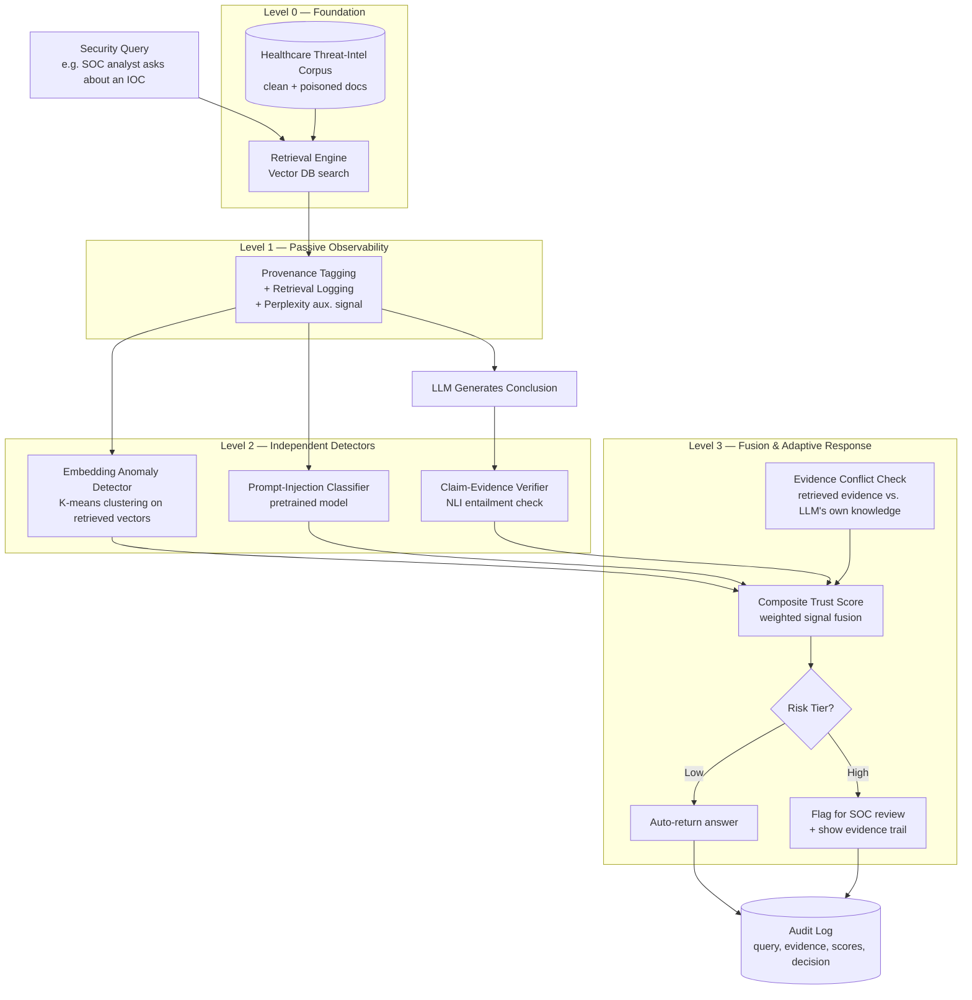

# Hallucinations in AI-Driven Cybersecurity Systems: A Healthcare Sector Perspective

**Team Zetabyte** — Deloitte Capstone Program 2026, Manipal University Jaipur

---

## 1. Problem Statement

Healthcare organizations are increasingly deploying LLM + Retrieval-Augmented Generation (RAG) systems to triage threat intelligence, summarize security advisories, and support SOC (Security Operations Center) analysts. These systems retrieve evidence from a knowledge base and generate a conclusion — e.g., "Is this IP associated with known ransomware infrastructure?"

This introduces a security-specific failure mode that generic AI hallucination research does not address: **an attacker can deliberately poison the retrieval corpus to make the model confidently generate a specific false conclusion.** This is different from an ordinary hallucination (the model making an unforced factual error). It is an *engineered* failure, and in a healthcare-cybersecurity context — where a wrong SOC conclusion can mean a missed ransomware indicator, a misclassified breach, or a delayed clinical-system lockdown — the cost of not detecting it is severe.

Existing hallucination-mitigation tools (Galileo, Cleanlab, Ragas, Guardrails AI, etc.) treat hallucination as a data-quality problem: *did the model make something up?* None of them are built to answer the security question: *did an adversary engineer the retrieval context to produce this specific wrong answer, and can the system tell the difference from an honest mistake?*

**That gap — attack-induced vs. ordinary hallucination, in a healthcare threat-intelligence RAG pipeline — is the problem this project solves.**

---

## 2. Our Solution

We propose a **trust-and-risk layer that sits between retrieval and generation** in a healthcare-sector security RAG pipeline. Instead of trusting retrieved evidence and generated conclusions by default, the system:

1. Tags and monitors the provenance and retrieval behavior of every piece of evidence
2. Runs independent, lightweight detectors for the most common attack surfaces (poisoned embeddings, prompt injection, evidence conflict, unsupported claims)
3. Fuses these signals into a single composite trust score
4. Escalates only the high-risk cases for deeper checking or human review — instead of running expensive verification on every single query

This is a **defense-in-depth, risk-adaptive** design: no single detector is trusted alone, and computational cost is spent only where risk is highest. This isn't our opinion — it's the consistent conclusion across all seven papers we reviewed (see [Section 6](#6-key-findings-from-the-literature)).

---

## 3. Why This Is a Real Problem (Not a Toy Exercise)

- **PoisonedRAG** (USENIX Security 2025) empirically demonstrated that a small number of carefully crafted documents can manipulate a RAG system into attacker-chosen answers — this is a peer-reviewed, reproducible attack, not a hypothetical.
- **TrustRAG** (arXiv 2025) exists specifically because production RAG systems have no built-in defense against this; it had to be built as a bolt-on layer.
- Commercial RAG-evaluation tools (Galileo, Arize Phoenix, Cleanlab, Patronus, Ragas) are a fast-growing category — proof the market takes RAG trust seriously — but every one of them evaluates *factuality*, not *adversarial intent*. We found no existing system that frames hallucination detection as a security problem specifically for healthcare threat intelligence.
- Healthcare is a uniquely high-stakes sector for this: AI-assisted SOC tools are being adopted faster than their trust infrastructure is maturing, and a poisoned conclusion here has downstream clinical and operational consequences, not just an embarrassing wrong answer.

**This is where our novelty sits:** not inventing a new detection technique, but being the first (to our research) to combine existing RAG-security techniques into a system explicitly framed around attacker-induced hallucination in a healthcare cybersecurity context.

---

## 4. Proposed Architecture (Level 0 → Level 3)

We organized every finding from the seven papers into five difficulty levels (Level 0 = foundation, Level 5 = full agentic system). **This capstone builds Levels 0–3.** Full breakdown below.

### Component breakdown

| Level | Component | What it does | Source papers |
|---|---|---|---|
| L0 | RAG baseline | Retrieve → generate, no security layer yet | Baseline across all papers |
| L0 | Clean + poisoned corpus | Healthcare threat-intel docs; poisoned set built using PoisonedRAG's method | P5 |
| L1 | Source provenance tagging | Every doc gets a source ID + trust label | P2, P4, P6 |
| L1 | Retrieval logging | Similarity scores, source IDs, top-k captured per query | P1, P5, P6 |
| L1 | Perplexity (auxiliary only) | Logged, but explicitly *not* used as a primary signal | P1, P5 |
| L2 | Embedding anomaly detection | K-means clustering on retrieved embeddings flags outlier documents | P1 (TrustRAG), P4, P5 |
| L2 | Prompt-injection classifier | Pretrained classifier flags injection attempts in retrieved content | P4, P6, P7 |
| L2 | Claim-evidence verification | NLI/entailment model checks whether the generated claim is actually supported by retrieved evidence — **our core differentiator** | P3, P5 |
| L3 | Evidence conflict resolution | Compares retrieved evidence against the LLM's own internal knowledge; flags disagreement | P1, P3 |
| L3 | Composite trust score | Weighted fusion of all L1/L2/L3 signals into a single risk score | Supported across all 7 papers |
| L3 | Risk-adaptive escalation | Low risk → auto-return; high risk → flag for review — avoids running expensive checks on every query | P1, P4, P6 |
| L3 | Audit log | Every query, retrieved evidence, signal scores, and final decision recorded | P3, P6 |

---

## 5. Why We Are Stopping at Level 3

This capstone has a **15-day build window** and no paid API budget (open-source models only). Levels 4 and 5 involve real cost/complexity jumps — a second LLM call per query for cross-verification, agentic tool firewalls, full human-in-the-loop review workflows — that would either blow the timeline or dilute focus away from proving the core thesis.

**Level 0–3 is not a "reduced" version of the idea — it is a complete, defensible system.** It demonstrates the exact principle the literature argues for: no single detector should be trusted alone (P1, P4, P6), and computational cost should be spent adaptively based on risk (P1, P4, P6). Stopping here lets us build every component with real evaluation, rather than a longer list of shallow, unverified components.

Our goal for this capstone is **not to build a production-grade system** — it is to demonstrate, with working code and measurable results, that attacker-induced hallucination in a healthcare-cybersecurity RAG pipeline is detectable and that a layered, risk-adaptive defense measurably reduces attack success rate compared to a vanilla RAG baseline.

---

## 6. Key Findings from the Literature

| Question | Answer from the papers | Supporting papers |
|---|---|---|
| Can RAG be deliberately poisoned? | Yes — empirically demonstrated, not theoretical | P5, P2, P4 |
| Is one detector enough? | No — use defense-in-depth | P1, P4, P6 |
| Should perplexity be the main signal? | No — clean and malicious text overlap in perplexity | P1, P5 |
| Should retrieval itself be monitored? | Yes | P1, P2, P5, P6 |
| Should generated output be checked against evidence? | Yes | P1, P3, P7 |
| Should an LLM alone judge its own security? | No — combine model-based and independent checks | P4, P7 |
| Is computational cost a real constraint? | Yes — use risk-adaptive escalation | P1, P4, P6 |
| Should flagged documents be auto-deleted? | No — naive deletion removes clean docs and misses lone poisoned ones | P1 |
| Is RAG grounding alone sufficient? | No — PoisonedRAG shows malicious content can still look "grounded" | P5 |

---

## 7. Future Scope (Level 4 & 5 — Roadmap Beyond This Capstone)

- **Cross-LLM verification** — a second model provides an independent opinion, but only on high-risk cases flagged by Level 3 (P1, P2, P7)
- **Secondary/deeper retrieval** — re-query with a different strategy when evidence conflict is detected
- **Nuanced poisoning response** — route ambiguous singleton documents for special handling instead of blanket deletion (P1's own caution)
- **Agent/tool firewalls** — gate any automated security actions the system might eventually take (P2, P6)
- **Full human-in-the-loop audit workflow** — structured SOC analyst review and sign-off, not just a flag
- **Knowledge graph / multimodal RAG** — the source papers themselves identify this as open future work (P3)

---

## 8. References

1. **P1** — TrustRAG: Enhancing Robustness and Trustworthiness in Retrieval-Augmented Generation. arXiv:2501.00879v3 (2025).
2. **P2** — Mu, Y. et al. Towards Secure Retrieval-Augmented Generation: A Comprehensive Review of Threats, Defenses and Benchmarks. arXiv:2603.21654v1 (2026).
3. **P3** — Trustworthiness in Retrieval-Augmented Generation Systems: A Survey. arXiv:2409.10102v2 (2026 update).
4. **P4** — Gulyamov, S. et al. Prompt Injection Attacks in Large Language Models and AI Agent Systems: A Comprehensive Review of Vulnerabilities, Attack Vectors, and Defense Mechanisms. *Information* 17, 54 (2026).
5. **P5** — Zou, W., Geng, R., Wang, B., Jia, J. PoisonedRAG: Knowledge Corruption Attacks to Retrieval-Augmented Generation of Large Language Models. 34th USENIX Security Symposium (2025).
6. **P6** — Khonde, S.R. et al. End-to-End Security Threats and Defenses in Retrieval-Augmented LLM Agents. *Discover Artificial Intelligence* (2026), article in press in the reviewed version.
7. **P7** — Gokcimen, T., Das, B. A Novel System for Strengthening Security in Large Language Models Against Hallucination and Injection Attacks with Effective Strategies. *Alexandria Engineering Journal* 123 (2025), 71–90.

---

## 9. Project Status

- [x] Literature synthesis complete (7 papers reviewed and mapped)
- [x] Architecture designed (Level 0–3 scoped for this capstone)
- [ ] Corpus construction (clean + poisoned healthcare threat-intel docs)
- [ ] Pipeline implementation
- [ ] Evaluation against baselines
- [ ] Final report & demo

*File structure, repository layout, and implementation code to be added in the next phase.*
