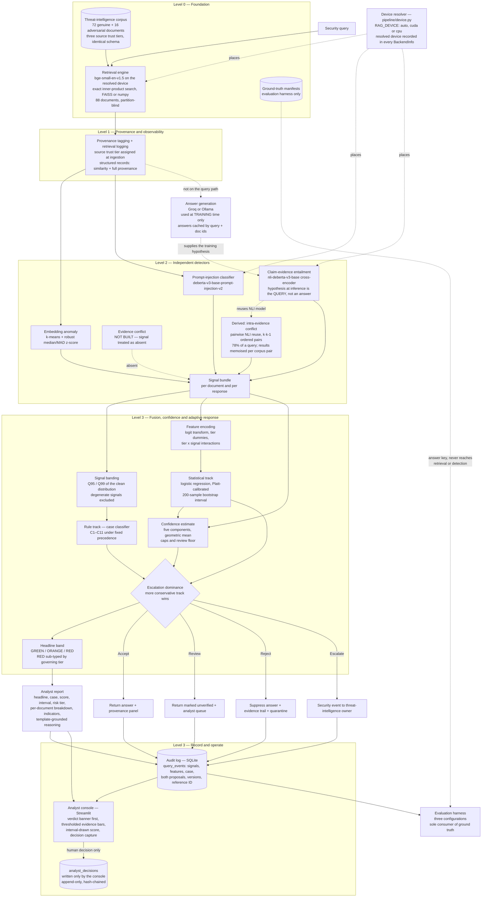

# Detecting Attacker-Induced Hallucination in Healthcare Threat-Intelligence RAG Systems

**Team Zetabyte** — Deloitte Capstone Programme 2026, Manipal University Jaipur

A trust-and-risk layer for retrieval-augmented generation pipelines in healthcare
security operations. The system detects **corpus poisoning** — adversarial documents
inserted into a knowledge base to make a security assistant confidently produce a
specific false conclusion — and distinguishes it from ordinary model error.

| Document | Purpose |
|---|---|
| [`docs/design/TRUST_RISK_DESIGN.md`](docs/design/TRUST_RISK_DESIGN.md) | Authoritative specification (`design-v1.4`): case definitions, feature encoding, thresholds, audit schema |
| [`docs/FINAL_PROJECT_LOG.md`](docs/FINAL_PROJECT_LOG.md) | Executive summary, development history, evaluation results, limitations |
| [`docs/RUNBOOK.md`](docs/RUNBOOK.md) | Installation, verification and demonstration procedure |
| [`docs/AUDIT_REPORT.md`](docs/AUDIT_REPORT.md) | Independent verification of deliverables against specification |

---

## 1. Overview

### 1.1 Problem

Healthcare organisations increasingly deploy LLM systems with retrieval-augmented
generation to triage threat intelligence and support security operations centre
analysts. These systems retrieve evidence from a knowledge base and generate a
conclusion — for example, *"Is this IP address associated with known ransomware
infrastructure?"*

This introduces a failure mode that generic hallucination research does not address:
**an adversary who can introduce documents into the retrieval corpus can cause the
model to confidently generate a chosen false conclusion.** This differs from an
unforced factual error. It is engineered, it is reproducible, and in a healthcare
security context the consequences include missed ransomware indicators, misclassified
breaches, and delayed response to compromised clinical systems.

Existing RAG evaluation tools treat hallucination as a data-quality problem — *did the
model fabricate content?* None addresses the security question: *did an adversary
engineer the retrieval context to produce this specific conclusion, and can the system
distinguish that from an honest error?*

### 1.2 Approach

A trust-and-risk layer positioned between retrieval and answer delivery. Rather than
accepting retrieved evidence by default, the system:

1. Attaches provenance and a source trust tier to every retrieved document
2. Runs three independent detectors over the retrieval set
3. Classifies the situation into one of eleven named cases and, in parallel, fuses the
   detector signals into a calibrated composite risk score with a separate confidence
   estimate
4. Reconciles the two assessments conservatively and emits a three-state disposition
5. Records every decision, and every subsequent human judgement, in a tamper-evident
   audit trail

The design is defence-in-depth and risk-adaptive: no single detector is trusted alone,
and computational cost is spent in proportion to assessed risk. This follows the
consistent conclusion of the seven papers surveyed (§10).

### 1.3 Threat model

The adversary can write documents into the retrieval corpus but cannot modify the
model, the retriever, or the detection layer. This is the setting established by
PoisonedRAG (Zou et al., USENIX Security 2025), which demonstrated empirically that a
small number of crafted documents suffices to control a RAG system's output.

Three failure modes are distinguished, because they require different responses:

| Failure mode | Characterisation | System response |
|---|---|---|
| **Corpus poisoning** | Adversarial content from a source not previously verified | Reject the answer; quarantine the document |
| **Trusted-source anomaly** | A previously verified source behaving irregularly | Escalate — the source, not the query, is the concern |
| **Authoritative divergence** | Two verified sources contradicting each other | Present both; never adjudicate |

The third is explicitly **not** an attack. It is usually an advisory revision, and a
system that silently selects a winner conceals the most decision-relevant fact
available to the analyst.

---

## 2. System Architecture

The system is organised into four levels. Levels 0–3 are implemented.



### 2.1 Component summary

| Level | Component | Implementation | Basis |
|---|---|---|---|
| L0 | Compute device | `pipeline/device.py` — one resolver for every model; `RAG_DEVICE` selects, resolved device reaches the audit trail | §9A.6 |
| L0 | Retrieval corpus | `corpus/` — 72 genuine, 16 adversarial, three tiers, ground truth held externally | §4 |
| L0 | Baseline RAG | `pipeline/` — the control condition, no security layer | Baseline across all sources |
| L1 | Provenance tagging | Source trust tier assigned at ingestion, never modified by detector output | P2, P4, P6 |
| L1 | Retrieval logging | Structured records with similarity and full provenance to `logs/retrieval_log.jsonl` | P1, P5, P6 |
| L2 | Embedding anomaly | `detectors/anomaly.py` — k-means with robust median/MAD normalisation | P1, P4, P5 |
| L2 | Prompt-injection classifier | `detectors/injection.py` — positive class resolved by label name | P4, P6, P7 |
| L2 | Claim-evidence entailment | `detectors/entailment.py` — the principal differentiator | P3, P5 |
| L2 | Intra-evidence conflict | Derived by pairwise reuse of the NLI model; no additional dependency | P1, P3 |
| L3 | Case classifier | `fusion/cases.py` — eleven cases, fixed precedence | Design §2 |
| L3 | Composite risk score | `fusion/model.py` — fitted logistic regression, not a hand-weighted sum | All sources |
| L3 | Confidence estimate | `fusion/confidence.py` — reported alongside risk, never folded into it | Design §4 |
| L3 | Adaptive response | `fusion/scorer.py` — Accept / Review / Reject / Escalate | P1, P4, P6 |
| L3 | Headline classification | `fusion/cases.py` — GREEN / ORANGE / RED with RED sub-typing | Design §2.9 |
| L3 | Analyst report | `reports/` — template-grounded reasoning, regex indicator extraction | Design §2.9, §5.3 |
| L3 | Audit trail | `logs/audit.py` — hash-chained, append-only | P3, P6 |
| L3 | Analyst console | `dashboard/` — headline-first presentation, decision capture | P3, P6 |
| L3 | Console presentation | `dashboard/style.py` — design tokens and markup builders; computes nothing | Design §2.9 |

---

## 3. Decision Logic

The full specification is [`docs/design/TRUST_RISK_DESIGN.md`](docs/design/TRUST_RISK_DESIGN.md).
The summary below is orientation.

### 3.1 Source trust tiers

| Tier | Definition | Examples |
|---|---|---|
| 1 | Verified authoritative | CISA advisories, HHS bulletins, vendor PSIRT |
| 2 | Trusted but community-writable | ISAC member bulletins, moderated feeds |
| 3 | Unverified | Open-source intelligence, unattributed reporting |

The tier is a property of the **source**, assigned at ingestion, and is never modified
by detector output. It functions as a prior, not a verdict.

### 3.2 Five distinct outputs

Each query produces a headline band, a case classification, a risk score, a confidence
value, and — once an analyst acts — a decision record. These are kept separate because
a high-risk finding corroborated by five independent sources and a high-risk estimate
derived from a single document require different responses, and a single scalar cannot
express that difference.

### 3.3 Two tracks, reconciled conservatively

A **rule track** (the case taxonomy) and a **statistical track** (the fitted model)
evaluate the same inputs. The final disposition is the more conservative of the two on
the ordering `Accept < Review < Reject < Escalate`. This guarantees that introducing
the statistical track cannot make the system less safe than the rules alone. Only the
rule track can produce Escalate, because escalation is a claim about the system rather
than about the answer and requires the semantic structure of a case.

### 3.4 Case taxonomy — eleven cases

Nine cases arise from crossing three trust tiers with three content outcomes; two are
cross-cutting cases defined on the structure of the retrieval set. Assignment is
deterministic under a fixed precedence order.

| Precedence | Case | Condition | Priority | Action |
|---|---|---|---|---|
| 1 | C5 Authoritative Channel Compromise | Tier 1 × Malicious | P0 | Escalate |
| 2 | C4 Trusted-Source Anomaly | Tier 1 × Suspicious | P1 | Escalate |
| 3 | C11 Isolated Retrieval Outlier | Set-level | P1 | Escalate |
| 4 | C10 Authoritative Divergence | Tier 1 vs Tier 1 | P2 | Review |
| 5 | C7 Open-Feed Poisoning | Tier 2 × Malicious | P2 | Reject |
| 6 | C9 Expected-Path Poisoning | Tier 3 × Malicious | P2 | Reject |
| 7 | C6 Open-Feed Irregularity | Tier 2 × Suspicious | P3 | Review |
| 8 | C8 Unverified Irregularity | Tier 3 × Suspicious | P3 | Reject |
| 9 | C3 Unverified but Unremarkable | Tier 3 × Clean | P3 | Review |
| 10 | C2 Community Corroboration | Tier 2 × Clean | P4 | Accept |
| 11 | C1 Authoritative Confirmation | Tier 1 × Clean | P5 | Accept |

Two entries carry the taxonomy's principal claims:

**C4 outranks C9** — a *suspicious* Tier-1 document is ranked above a *malicious*
Tier-3 one. Anomalous behaviour is improbable from Tier 1 by construction, so observing
it carries substantially more information. Tier-1 sources are trusted by every
downstream consumer, so the blast radius is larger. And every plausible explanation —
source compromise, intercepted fetch path, provenance mislabelling, insider
modification — constitutes a finding about the system itself. The action is therefore
Escalate rather than Reject.

**C10 is not poisoning** — high inter-document contradiction with quiet attack
indicators characterises advisory revision or genuine analytic disagreement. The system
is bound never to select between two authorities. The quiet-indicator condition
matters: contradiction accompanied by a live injection signal is handled by C5 instead.

### 3.5 Headline classification

Derived from the reconciled action and the governing tier; never stored as an
independent judgement, so it cannot contradict the disposition actually taken.

```
RED     if action in (Reject, Escalate)
          sub-type: governing tier == 1  ->  TRUSTED_SOURCE_COMPROMISE
                    otherwise            ->  ATTACK_DETECTED
ORANGE  if action == Review, or governing tier != 1
GREEN   if action == Accept and governing tier == 1
ORANGE  otherwise                                    (fail-safe default)
```

**RED is sub-typed** because a malicious document from an unverified source and an
anomaly in a verified advisory can carry the same risk score while requiring different
responses: the first is closed by quarantining a document, the second is a finding
about trust infrastructure that outlives the query.

**GREEN is reachable only by affirmative conjunction** — an explicit Accept *and* a
Tier-1 governing source. Every other path terminates at ORANGE, including unrecognised
actions and missing tiers. There is no `else: GREEN` branch. The Tier-2 and Tier-3
exclusions are enforced and tested independently, and verification confirms no Tier-2 or
Tier-3 source produces GREEN under any tested input.

### 3.6 Scoring methodology

Logistic regression fitted on the labelled corpus. Bounded signals receive a logit
transform; the anomaly distance is robustly normalised within each query's retrieval
set.

**Source tier is dummy-coded, never ordinal.** An ordinal encoding would impose a
monotone relationship between tier number and risk, rendering the C4/C9 inversion
structurally unrepresentable. Tier × signal interaction terms allow the model to
express that a given signal carries different weight depending on source tier.

Evaluation derives from one stated assumption — a missed attack costs approximately ten
times a false alarm: PR-AUC for model selection, F₃ as the headline scalar, recall at a
fixed alert budget as the operating metric. Splits are grouped by attack family with a
locked test set. Precision is additionally reported corrected to realistic deployment
prevalence.

### 3.7 Confidence

Five components — evidence volume, evidence agreement, source independence, detector
coherence, and model stability under bootstrap — combined by geometric mean, so a single
weak component constrains the composite. A single-document answer is capped and can
never be high confidence. Low confidence widens the risk interval and moves borderline
cases toward Review; it can never relax a disposition.

### 3.8 Audit trail

`query_events` records every signal, the encoded feature vector, both track proposals,
the final action, the headline band, and a full version stamp. `analyst_decisions`
records the human disposition as Accept / Reject / Override with a controlled-vocabulary
reason code, per-document verdicts, and decision latency.

**The analyst decision is never populated by the system.** An unreviewed event has no
row — not a null, and not a `PENDING` sentinel, because a sentinel in the same column as
real verdicts requires every future aggregate to exclude it, and the first query that
omits the exclusion is silently wrong. Three mechanisms enforce this: the column is
`NOT NULL` with no `DEFAULT`; the class held by the scoring pipeline has no method that
writes to the table; and every row records its write path, with non-analyst sources
excluded from the labelled view. Corrections append a superseding row rather than
editing. Each row hashes its own content plus its predecessor's, so modifying any
historical row invalidates every subsequent hash.

---

## 4. Corpus

Full detail in [`corpus/README.md`](corpus/README.md).

| Partition | Documents | Tier 1 | Tier 2 | Tier 3 |
|---|---|---|---|---|
| Genuine | 72 | 40 | 21 | 11 |
| Adversarial | 12 | 2 | 5 | 5 |

Construction is deterministic: identical inputs produce byte-identical output. Source
trust tier is assigned in exactly one place — a source registry — and never within a
document file.

**Ground truth is held outside the documents.** Both partitions share an identical
27-field schema, so document structure carries no signal distinguishing them. Labels
reside in `corpus/ground_truth/`, which only evaluation code reads; the validator fails
if any answer-key field appears inside a document, and an AST-based check confirms no
module in `pipeline/` or `detectors/` references the manifests.

The adversarial partition follows the PoisonedRAG method across six attack families:
indicator reputation inversion, severity downgrading, authority spoofing, remediation
misdirection, attribution fabrication, and direct prompt injection. Each carries a
`target_query_id` identifying the question it was constructed to intercept.

---

## 5. Detectors

Full detail in [`detectors/README.md`](detectors/README.md). Three detectors operate over
the retrieval set, deliberately independent — none observes another's output. All scores
are normalised to [0, 1] and returned **per document**, never only as an aggregate.
Fusion takes the maximum over cited documents rather than the mean, since one crafted
document among several genuine ones constitutes the entire attack.

| Detector | Model | Note |
|---|---|---|
| Embedding anomaly | k-means with robust median/MAD z-score | Expected weakest; see below |
| Prompt injection | `protectai/deberta-v3-base-prompt-injection-v2` | Positive class resolved by label name |
| Entailment | `cross-encoder/nli-deberta-v3-base` | Higher = safer; risk complement returned |
| Intra-evidence conflict | Same NLI model, pairwise | Quantity on which C10 turns |

**Min-max normalisation was rejected.** Min-max over a retrieval set always assigns one
document 1.0 and another 0.0 regardless of whether anything is anomalous, manufacturing
a maximum-severity outlier in every clean set. The anomaly detector scales by dispersion
instead, so a clean set scores near zero throughout. Below four documents it does not
cluster; at one document it returns 0.0.

**Label positions are resolved by name, not index.** Both DeBERTa models have shipped
with differing label orderings across releases. An inverted injection classifier flags
every clean document; an inverted NLI model exchanges entailment for contradiction.

**The anomaly detector is expected to be the weakest, and this is a finding rather than
a defect.** PoisonedRAG documents are constructed to sit close to the query in embedding
space — that is the attack mechanism. A document engineered for retrieval proximity can
fall inside the cluster it targets.

---

## 6. Fusion and Analyst Report

Full detail in [`fusion/README.md`](fusion/README.md) and
[`reports/README.md`](reports/README.md).

### 6.1 Signal banding

Thresholds are quantiles of each signal's distribution over **genuine** documents —
`θ_suspicious = Q95`, `θ_malicious = Q99` — not hand-selected. This makes the
false-positive rate a design input rather than a post-deployment discovery, and the
thresholds move automatically when a detector is replaced.

Injection alone is sufficient for a MALICIOUS band; the other signals are not.
Anomalous embeddings, unsupported claims and knowledge conflicts all admit benign
explanations. Instruction text directed at a language model inside a threat-intelligence
document does not.

A **missing** signal is excluded rather than zero-filled, since zero asserts an absence
of conflict for which there is no evidence. A **degenerate** signal — one whose clean
distribution has negligible spread — is marked unusable and excluded entirely, because
its quantiles are the constant rather than thresholds.

### 6.2 Template-grounded reasoning

The reasoning narrative in each analyst report is generated by template substitution,
not by a language model. Every numeric value is supplied by a `Fact` object carrying the
value together with a JSON pointer into the report structure. Templates contain slots
and never literals, and refuse to render when a value is absent.

> Flagged because `claim_unsupport_score` = 1.000 on document cisa-adv-9, exceeding the
> malicious threshold of 0.990 by +0.010, on a Tier 1 source.

This constraint is enforced by test: every numeric token is extracted from the
**rendered** narrative and must resolve to a real value at a real path in the report
object. Two negative controls confirm the check can fail — an injected fabricated figure
must be detected, and a pointer to a non-existent field must fail to resolve.

The rationale is specific. A model asked to explain a flag is correct most of the time;
when incorrect it produces a plausible figure attached to a real detector, in a report
indistinguishable from a correct one. That is the precise failure mode the system exists
to prevent. Additionally, the input to such a generation step would be a document the
system may already assess as adversarial.

### 6.3 Indicator extraction

IP addresses, domains, URLs, file hashes and CVE identifiers are extracted by pattern
matching only. Analysts pivot on these values — an invented indicator directs
investigation toward something that was never present. Defanged indicators are
re-fanged before matching; version strings, filenames and citation domains are
suppressed; each indicator records the documents in which it appeared.

### 6.4 Console presentation

The analyst console renders the report; it does not recompute any part of it. Design
tokens, the stylesheet and the markup builders are isolated in
[`dashboard/style.py`](dashboard/style.py), whose functions accept plain values and
return strings — a dashboard that derives its own figures is a second implementation
of the scoring logic, and the two drift.

Three presentation rules are load-bearing rather than aesthetic.

**The verdict banner is rendered first.** Nothing precedes it: no heading, no metric,
no spinner. This is design §2.9, and it is enforced as a property of call order by
`test_dashboard.py`, which records every rendering call and asserts the banner is the
first. The stylesheet is therefore injected from the page file rather than from the
banner function; injected from the banner it would itself become the first call and
the requirement would cease to be tested.

**State is never carried by colour alone.** Every band, fired detector and trust tier
presents an icon and a word beside its colour. The four state colours are validated
against the console surface — all clear the 3:1 contrast floor, with worst-pair
separation of ΔE 11.3 under simulated colour-vision deficiency against a ΔE 8 target —
but a projector, a colourblind reviewer and a greyscale printout each remove the
colour channel outright, and the verdict must still arrive. Source trust tiers are
drawn as neutral badges of differing weight for the same reason state colour is
reserved: a tier is an ordinal fact about provenance, not an alarm.

**Absence is distinguished from zero.** Each detector reading is drawn as a bar
against its two thresholds, so proximity to firing is legible without arithmetic. A
reading whose status is `unusable` or `missing` is drawn as text instead of as an
empty bar — an empty bar reads as a clean measurement, which is the opposite of what
an uncalibrated detector means. The exact values remain in a numeric table beneath
each set of bars.

---

## 7. Evaluation

Harness: [`eval/run_evaluation.py`](eval/run_evaluation.py). Results:
[`eval/results/`](eval/results/). Narrative treatment:
[`docs/sprint_logs/SESSION_10_evaluation.md`](docs/sprint_logs/SESSION_10_evaluation.md).

Three configurations over the same 88-document corpus, 40 queries (10 target, 30
control), k = 5, with every detector on its specified model.

| Metric | A · No retrieval | B · Baseline RAG | C · Full system |
|---|---|---|---|
| Attack success — adversarial content reached the user | 0%\* | 100% | **60.0%** |
| Attack success — system vouched for the content | 0%\* | 100% | **0.0%** |
| False positive rate — genuine documents blocked | 0%\* | 0%\* | **50.0%** |
| Genuine queries routed to human review | 0%\* | 0%\* | **100.0%** |
| Adversarial documents reaching the user | 0%\* | 100%\* | **50.0%** |
| Automatically accepted without human review | 100% | 100% | **0.0%** |
| Routed to human review | 0% | 0% | **50.0%** |
| Blocked | 0% | 0% | **50.0%** |
| Added latency per query — first time asked | — | 8.8 ms | **1,101 ms** |
| Added latency per query — asked again | — | 8.8 ms | **~84 ms** |

\* True by the configuration's definition rather than measured. A system without
retrieval cannot be poisoned; a system without a security layer cannot flag anything.
Neither zero constitutes a security result.

### 7.1 Interpretation

The system did not, in any case, return adversarial content within a response it
vouched for, where the baseline did so in every case. On that measure the reduction is
100% → 0%.

Adversarial content nevertheless reached the user in 6 of 10 attack cases, flagged as
unverified. The system achieves its safety result by automatically accepting no queries
at all and routing every genuine query to human review. At this operating point the layer
functions as a review-generation mechanism rather than a filter, and that is a finding
about the operating point rather than about the detectors.

**Latency.** The security layer costs 1,101 ms per query against a baseline retrieval of
8.8 ms. That figure is 78% one component — the pairwise contradiction check, which scores
every ordered pair of retrieved documents as design §0.4 specifies — and it is a
measurement on a laptop GPU at k = 5, not an estimate. Design §9A.6 records the full
breakdown and resolves the design's own Open Question 2 in the affirmative: the quadratic
comparison is affordable at this depth, and the fallback of restricting it to cited
documents was not needed. Repeat queries cost roughly 84 ms, because pair results are
memoised against a fixed corpus.

### 7.2 Metric definition

The initial evaluation reported 0.0% attack success and 100% detection across all attack
families. This was an artefact of the metric definition: attack success was defined as
adversarial content returned within a vouched-for response, and the system rarely
vouches for anything. A Review disposition nevertheless **returns the answer** to the
user. The evaluation now reports both definitions permanently, alongside the acceptance
and review rates, since an attack-success rate is not interpretable without the
disposition mix that produced it.

### 7.3 Detection by attack family

| Attack family | Blocked | Rate |
|---|---|---|
| Direct prompt injection | 1 / 1 | 100% |
| Authority spoofing | 2 / 5 | 40% |
| Remediation misdirection | 1 / 7 | 14% |
| Attribution fabrication | 0 / 3 | 0% |
| Indicator reputation inversion | 0 / 7 | 0% |
| Severity downgrading | 0 / 6 | 0% |

Three of six families were not blocked in any instance. Every retrieved adversarial
document was assigned C1, C2 or C3 — the three clean cases. At document level, no
adversarial document was flagged by the detectors. The protection observed derives from
the tier and case rules rather than from detection.

### 7.4 Measurement constraints

These results were produced with all three detectors operating on fallback backends,
because the development environment could not reach the model repository. Lexical
overlap, substituting for the entailment model, **cannot detect contradiction** — which
is precisely what a severity-downgrade or reputation-inversion attack constitutes.

Consequently the evaluation demonstrates that the **architecture** functions end to end.
It does not establish detection performance. Attack success is measured as a containment
proxy rather than at answer level, since no generation backend was available; because a
document must reach the model for the attack to succeed, the proxy is a strict upper
bound on the true rate.

**Installing the production detector models and re-running this evaluation is the single
highest-value remaining action on the project.**

---

## 8. Installation and Operation

Complete procedure: [`docs/RUNBOOK.md`](docs/RUNBOOK.md).

### 8.1 Docker (recommended)

```bash
docker compose build
docker compose run --rm verify        # build index, run all six test suites
docker compose up dashboard           # analyst console at http://localhost:8501
docker compose run --rm evaluate      # three-configuration comparison
```

### 8.2 Local installation

```bash
python -m venv .venv && source .venv/bin/activate    # Windows: .venv\Scripts\activate

# TORCH FIRST, and the build matters. The CPU-only wheel below is correct for a
# machine without an NVIDIA GPU. On a machine WITH one, install the CUDA build
# instead -- the CPU wheel contains no GPU support at all, so no configuration
# can reach a card from it, and the only symptom is that every query takes about
# six times longer. Match the CUDA version to the driver (`nvidia-smi`).
pip install torch --index-url https://download.pytorch.org/whl/cpu     # no GPU
# pip install torch --index-url https://download.pytorch.org/whl/cu126  # NVIDIA GPU

pip install -r requirements.txt

python -m pipeline.check_backends     # verify model availability before anything else
python -m pipeline.build_index
python -m fusion.train

streamlit run dashboard/app.py
```

`RAG_DEVICE` overrides device selection (`auto`, `cuda`, `cpu`); `auto` uses a GPU only
when torch can actually reach one, and reports which of "no device present" and "this
build of torch cannot address a device" applies. Confirm placement and per-stage cost
before trusting any latency figure:

```bash
python -m eval.profile_latency       # device, model loads, pair counts, per-stage timings
```

### 8.3 Verification

```bash
python -m pipeline.test_pipeline      #  55 checks
python -m detectors.test_detectors    #  20 checks
python -m fusion.test_fusion          # 115 checks (112 without scikit-learn)
python -m reports.test_reports        # 100 checks
python -m logs.test_audit             #  62 checks
python -m dashboard.test_dashboard    #  55 checks
```

Run them as modules, as above. Under `pytest` the pipeline and detector suites report
collection errors — their test functions take arguments that pytest reads as fixtures —
and the audit suite fails on Windows during temporary-directory cleanup, because it does
not close its SQLite connections and Windows will not unlink an open file. Every
assertion inside those suites passes; the failures are in collection and teardown.

### 8.4 Programmatic use

```python
from pipeline.rag import BaselineRAG
from fusion import score_query
from reports import build_report, render_text
from logs.audit import AuditLog

records = BaselineRAG.from_disk().retrieve_top_k(query, k=5).records
score   = score_query(query, records)
report  = build_report(query, score, records)

print(render_text(report))
event_id = AuditLog().record_query(report)
```

---

## 9. Repository Layout

```
Capstone/
  README.md                  This document
  requirements.txt           Consolidated dependencies
  .streamlit/config.toml     Console theme applied to Streamlit's own widgets
  Dockerfile                 Container image definition
  docker-compose.yml         Service definitions: verify, dashboard, evaluate, shell
  docs/
    RUNBOOK.md               Installation, verification and demonstration procedure
    FINAL_PROJECT_LOG.md     Executive summary, development history, limitations
    AUDIT_REPORT.md          Independent verification against specification
    PROJECT_REPORT.md        Extended technical report (superseded in part; see §12)
    design/
      TRUST_RISK_DESIGN.md   Authoritative specification, design-v1.4
    sprint_logs/             Development session records (.md and .docx)
  corpus/
    schema.py                Shared field names, enumerations, tier rules
    build_clean_corpus.py    Deterministic genuine-partition builder
    build_poisoned_corpus.py Adversarial-partition builder
    validate_corpus.py       Pre-use validator
    sources/                 Source registry and document seeds
    clean/                   72 documents + index
    poisoned/                16 documents + index
    ground_truth/            Answer key — evaluation harness only
  pipeline/                  Baseline RAG: embeddings, retrieval, generation, logging
    device.py                Single resolver for CPU/CUDA placement of every model
  detectors/                 Three independent detectors + derived conflict signal
  fusion/                    Banding, case classifier, model, confidence, headline
    artifacts/               Fitted thresholds and coefficients
  reports/                   Analyst report: narrative engine, indicators, renderers
  logs/                      Audit log (SQLite) and retrieval log
  dashboard/                 Streamlit analyst console
    style.py                 Design tokens, stylesheet, markup builders
    pages/                   Audit log viewer
  eval/
    run_evaluation.py        Three-configuration comparison harness
    profile_latency.py       Device, model loading, pair counts, per-stage timings
    results/                 Comparison table, chart, full JSON output
      latency_history.json   One row per profiling run, oldest first
      archive_hashing_index/ Superseded results, with the reason attached
```

---

## 10. Technology Stack

Open-source components only; no paid API dependency.

| Layer | Selection |
|---|---|
| Embeddings | `sentence-transformers` (`bge-small-en-v1.5`) |
| Vector index | FAISS `IndexFlatIP`, or exact numpy inner-product where FAISS is absent |
| Generation | Groq free tier, or Ollama for local operation — training-time hypotheses only |
| Compute device | CPU or CUDA, resolved once by `pipeline/device.py` and recorded per score |
| Entailment | `cross-encoder/nli-deberta-v3-base` |
| Injection classification | `protectai/deberta-v3-base-prompt-injection-v2` |
| Fusion and calibration | scikit-learn |
| Audit store | SQLite |
| Analyst console | Streamlit |
| Console presentation | CSS and generated markup — no additional dependency |
| Containerisation | Docker, Docker Compose |

Every layer implements a fallback backend that activates when its model is unavailable,
reports `is_model=False`, and is named in the output of any script that produces a
figure. No fallback result can be presented as a measurement without an accompanying
warning.

---

## 11. Research Basis

| Question | Finding | Sources |
|---|---|---|
| Can RAG be deliberately poisoned? | Yes — empirically demonstrated | P5, P2, P4 |
| Is a single detector sufficient? | No — defence in depth required | P1, P4, P6 |
| Should perplexity be a primary signal? | No — clean and adversarial text overlap | P1, P5 |
| Should retrieval itself be monitored? | Yes | P1, P2, P5, P6 |
| Should output be verified against evidence? | Yes | P1, P3, P7 |
| Should an LLM judge its own security? | No — combine model-based and independent checks | P4, P7 |
| Is computational cost a real constraint? | Yes — risk-adaptive escalation required | P1, P4, P6 |
| Should flagged documents be deleted? | No — deletion removes genuine documents and misses isolated adversarial ones | P1 |
| Is RAG grounding alone sufficient? | No — poisoned content can appear well-grounded | P5 |

Perplexity is **not computed anywhere in this system**. This is a documented exclusion
based on the literature, not an omission, and a test asserts it never reaches a log
record.

### References

1. **P1** — TrustRAG: Enhancing Robustness and Trustworthiness in Retrieval-Augmented Generation. arXiv:2501.00879v3 (2025).
2. **P2** — Mu, Y. et al. Towards Secure Retrieval-Augmented Generation: A Comprehensive Review of Threats, Defenses and Benchmarks. arXiv:2603.21654v1 (2026).
3. **P3** — Trustworthiness in Retrieval-Augmented Generation Systems: A Survey. arXiv:2409.10102v2 (2026 update).
4. **P4** — Gulyamov, S. et al. Prompt Injection Attacks in Large Language Models and AI Agent Systems. *Information* 17, 54 (2026).
5. **P5** — Zou, W., Geng, R., Wang, B., Jia, J. PoisonedRAG: Knowledge Corruption Attacks to Retrieval-Augmented Generation of Large Language Models. 34th USENIX Security Symposium (2025).
6. **P6** — Khonde, S.R. et al. End-to-End Security Threats and Defenses in Retrieval-Augmented LLM Agents. *Discover Artificial Intelligence* (2026).
7. **P7** — Gokcimen, T., Das, B. A Novel System for Strengthening Security in Large Language Models Against Hallucination and Injection Attacks. *Alexandria Engineering Journal* 123 (2025), 71–90.

---

## 12. Limitations

Stated directly, since each affects how the results above should be read.

1. **The entailment hypothesis differs between training and inference.** The fitted
   model was trained on features computed with the generated answer as the entailment
   hypothesis, per §3.1 and design §9A.4 — which records that the query-text proxy
   *inverts* that signal, measuring AUC 0.248 against it. At inference neither the
   analyst console nor the evaluation harness supplies a generated answer, so both fall
   back to the query proxy and every row is stamped `hypothesis_source=query_proxy`. The
   coefficient on the unsupport feature is therefore being applied to a quantity that
   does not behave as the quantity it was fitted on. This is the most significant open
   correctness item in the system and it is not a latency artefact.
2. **Answer-level attack success is not measured.** The reported attack-success figures
   are the containment proxy — an adversarial document reaching a response the system
   vouched for. Containment is a strict upper bound on the answer-level rate, since the
   model must see a document but need not adopt its claim. That asymmetry favours the
   full system and penalises the baseline, and should be read with that in mind.
3. **The corpus is small.** Sixteen adversarial documents across six families. The
   statistical model operates at its underpowered setting; coefficients are indicative.
4. **The operating point is not deployable.** Nothing is automatically accepted and
   every genuine query is routed to review. As a filter this is useless; as a
   demonstration that the layer never vouches for poisoned evidence it is sound. The
   thresholds, not the detectors, are what would have to move.
5. **The evidence-conflict detector is not implemented.** It is specified but absent, and
   is treated throughout as absent rather than zero-valued.
6. **`docs/PROJECT_REPORT.md` predates the fusion, report, audit and dashboard work** and
   describes those components as unimplemented. It is retained for its corpus and
   pipeline sections; `docs/FINAL_PROJECT_LOG.md` supersedes it for current state.
7. **Latency is characterised on one machine.** 1,101 ms per query is a measurement at
   k = 5 on a single laptop-class GPU, under no concurrent load, against 88 documents.
   Cost is quadratic in retrieval depth — k = 8 is 56 ordered pairs against 20 — and the
   memoisation that makes repeat queries cheap helps in proportion to how much retrieval
   sets overlap, which is a property of the query mix rather than a guarantee.
8. **Results produced before 6 September 2026 rest on a fallback retriever.** The index
   had been built with the hashing fallback rather than bge-small-en-v1.5, so those
   figures describe a lexical matcher. They are archived at
   `eval/results/archive_hashing_index/` with the explanation attached. Rebuilding with
   the specified model left every detection figure identical, which is the evidence that
   the correction changed nothing but the provenance of the numbers.

### Future work

- **Cross-model verification** — a second independent model consulted only on cases the
  fusion layer has already flagged as high risk (P1, P2, P7)
- **Secondary retrieval** — re-query with a different strategy when evidence conflicts
- **Refined handling of isolated suspicious documents** — quarantine is currently blunt;
  P1 cautions that naive deletion removes genuine documents
- **Tool and action firewalls** — required if the system is extended beyond answering
  (P2, P6)
- **Recalibration from analyst decisions** — the schema exists and is deliberately unused
  within this capstone
- **Knowledge-graph and multimodal retrieval** — identified as open work in P3

---

## 13. Security Research Statement

Construction of adversarial documents in this project constitutes **defensive security
research**, following the published PoisonedRAG methodology (P5). The adversarial corpus
is synthetic, internal, and exists solely to provide ground-truth positives for
evaluating this project's own detection layer. It contains no real indicators, is never
deployed to any live retrieval system, and is never directed at any third-party system.
This framing is restated in the corpus module documentation and in the generator source.

---

## 14. Project Status

| Component | Status |
|---|---|
| Decision-logic specification (`design-v1.4`) | Complete |
| Corpus — 72 genuine, 16 adversarial, three tiers | Complete, validated, 0 errors |
| Baseline RAG pipeline | Complete, 55 checks passing |
| Level 2 detectors | Complete, 20 checks passing |
| Level 3 fusion, scoring, confidence | Complete, 115 checks passing |
| Analyst report generator | Complete, 100 checks passing |
| Audit log | Complete, 62 checks passing |
| Analyst console | Complete, 55 checks passing |
| Evaluation harness | Complete; results in `eval/results/` |
| Containerisation | Complete |
| Detector models installed and evaluation re-run | Complete — real models, GPU or CPU |
| Latency characterisation and device placement | Complete — design §9A.6, Open Question 2 resolved |
| Generation backend on the inference path | **Outstanding** — wired for training only; see Limitation 1 |
| Evidence-conflict detector | **Outstanding** |
| Leave-one-attack-family-out evaluation | **Outstanding** |

Total automated verification: **407 checks** across six suites, all passing.
