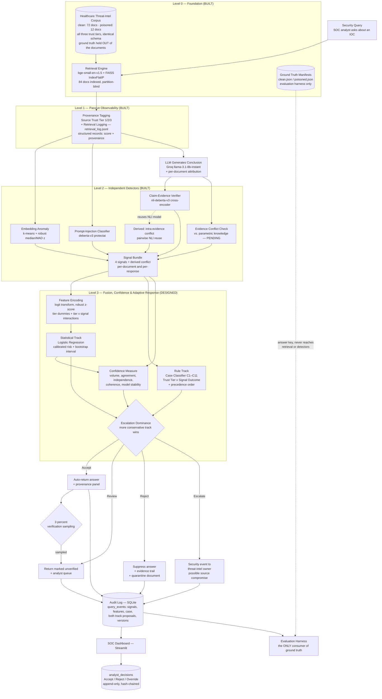

# Hallucinations in AI-Driven Cybersecurity Systems: A Healthcare Sector Perspective

## Comprehensive Project Report

**Team Zetabyte** — Deloitte Capstone Programme 2026
Manipal University Jaipur
Report date: 3 September 2026

---

## Contents

1. [Executive Summary](#1-executive-summary)
2. [Problem Statement and Novelty](#2-problem-statement-and-novelty)
3. [Scope: Why Levels 0–3](#3-scope-why-levels-03)
4. [System Architecture](#4-system-architecture)
5. [Design Decisions](#5-design-decisions)
6. [Implementation](#6-implementation)
7. [Technology Stack](#7-technology-stack)
8. [Verification Approach](#8-verification-approach)
9. [Decision Log](#9-decision-log)
10. [Known Limitations](#10-known-limitations)
11. [Outstanding Work](#11-outstanding-work)
12. [Repository Guide](#12-repository-guide)
13. [References](#13-references)

---

## 1. Executive Summary

This project addresses a failure mode that current AI-safety tooling does not cover:
**an adversary deliberately corrupting a retrieval corpus so that a security assistant
confidently produces a specific wrong conclusion.** The setting is healthcare threat
intelligence, where a wrong conclusion carries clinical consequences rather than merely
embarrassing ones.

The deliverable is a **trust-and-risk layer** positioned between retrieval and answer
delivery in a Retrieval-Augmented Generation (RAG) pipeline. Rather than trusting retrieved
evidence by default, it tags provenance, runs independent detectors, classifies the
situation into a named case, scores it, states how confident that score is, and records what
a human analyst did about it.

**Current state.** The design is complete and authoritative. The corpus, baseline pipeline
and all three Level 2 detectors are implemented and tested. Fusion, reporting, the dashboard
and the evaluation harness remain.

| Component | Status |
|---|---|
| Literature synthesis (7 papers) | Complete |
| Decision-logic design (`design-v1.1`) | Complete, authoritative |
| Clean corpus — 72 documents, 3 tiers | Built, validated |
| Poisoned corpus — 12 documents, 6 attack families | Built, validated |
| Ground-truth separation and leak guards | Enforced in code and tested |
| Baseline RAG pipeline | Built, 45 checks passing |
| Level 2 detectors (3 + 1 derived) | Built, 20 checks passing |
| Level 3 fusion and case classifier | Designed, not implemented |
| Report generator, dashboard, audit log | Designed, not implemented |
| Evaluation harness | Not implemented |

**The central methodological commitment** running through the whole project is that a
benchmark must be capable of producing a disappointing result. Several decisions recorded
below cost accuracy, convenience or apparent performance in order to preserve that property.

---

## 2. Problem Statement and Novelty

### 2.1 The problem

Healthcare organisations are deploying LLM + RAG systems to triage threat intelligence,
summarise advisories and support Security Operations Centre (SOC) analysts. These systems
retrieve evidence and generate a conclusion — "is this IP associated with ransomware
infrastructure?"

This introduces a security-specific failure mode that generic hallucination research does
not address. An ordinary hallucination is the model making an unforced error. **Corpus
poisoning is an engineered failure**: an attacker plants documents so that the model's
answer is not merely wrong but wrong *in a direction the attacker chose*.

In healthcare the cost is asymmetric. A missed ransomware indicator, a misclassified breach
or a delayed clinical-system lockdown has consequences measured in diverted admissions
rather than in user dissatisfaction.

### 2.2 Why existing tools do not cover it

Commercial RAG evaluation tooling — Galileo, Arize Phoenix, Cleanlab, Patronus, Ragas — is
a fast-growing category, which demonstrates the market takes RAG trust seriously. Every one
of them evaluates **factuality**: did the model make something up? None answers the security
question: **did an adversary engineer the retrieval context to produce this specific wrong
answer, and can the system distinguish that from an honest mistake?**

### 2.3 Two failure modes we also separate out

Beyond poisoning, the design distinguishes two situations that a purely factuality-oriented
tool would conflate with it:

- **A trusted source behaving anomalously**, which may indicate compromise of the *source*
  rather than of this query.
- **Two authoritative sources contradicting each other**, which is usually a legitimate
  advisory revision and is not an attack at all.

Both are treated as distinct cases with distinct responses. Section 5.2 sets out why.

### 2.4 Where the novelty sits

Not in inventing a detection technique. The contribution is combining existing RAG-security
techniques into a system explicitly framed around **attacker-induced hallucination in
healthcare threat intelligence**, with a case taxonomy that separates source compromise and
authoritative divergence from ordinary poisoning — a distinction we have not found in the
literature.

---

## 3. Scope: Why Levels 0–3

Findings from the seven reviewed papers were organised into six capability levels. This
capstone builds **Levels 0 through 3**.

| Level | Capability |
|---|---|
| 0 | Foundation: corpus and baseline RAG |
| 1 | Passive observability: provenance tagging and retrieval logging |
| 2 | Independent detectors |
| 3 | Fusion, confidence and adaptive response |
| 4 | Cross-LLM verification, secondary retrieval *(out of scope)* |
| 5 | Agentic tool firewalls, full human-in-the-loop workflow *(out of scope)* |

Levels 4 and 5 involve real cost jumps — a second LLM call per query, agentic firewalls,
full review workflows — that would either exceed the timeline or dilute focus from the core
thesis.

**Levels 0–3 is a complete system, not a reduced one.** It demonstrates precisely what the
literature argues for: no single detector trusted alone (P1, P4, P6), and computational cost
spent adaptively by risk (P1, P4, P6). Stopping here allows every component to be built with
real evaluation rather than producing a longer list of shallow, unverified parts.

---

## 4. System Architecture



### 4.1 Reading the diagram

Two structural properties are worth noting.

**The dotted line from ground truth goes only to the evaluation harness.** No path connects
the answer key to retrieval, the detectors or fusion. This is enforced in code, not by
convention — Section 6.1 explains how and why.

**Level 3 has two tracks that meet at a reconciliation node.** The rule track (case
classifier) and the statistical track (logistic regression) run over the same signals
independently, and the more conservative disposition wins. Section 5.3 explains why both
exist.

---

## 5. Design Decisions

The full specification is `docs/design/TRUST_RISK_DESIGN.md` (`design-v1.1`), which is the
authoritative source for case definitions, feature encoding and thresholds. This section
gives the reasoning; that document gives the detail.

### 5.1 Source trust tiers

| Tier | Definition | Examples |
|---|---|---|
| **1** | Verified, authoritative, institutionally attested | CISA advisories, MITRE ATT&CK, NVD, HHS HC3, vendor PSIRT |
| **2** | Trusted but open — reputable, moderated, community-writable | Curated OSINT feeds, security vendor research, ISAC bulletins |
| **3** | Unverified or unknown provenance | Unattributed reports, forum posts, uploaded analyst notes |

Tier is a property of the **source**, never of the content, and is never modified by detector
output. If detectors could change tier, the tiers would stop being an independent axis and
the entire cross-tabulation in the taxonomy would collapse.

**The tier is a prior, not a verdict.** The tier expresses belief before looking at content;
the detectors express the evidence; the case taxonomy is the posterior. This framing is what
makes the next subsection defensible rather than merely counter-intuitive.

### 5.2 Case taxonomy — eleven cases

Nine cases come from crossing three tiers with three content outcomes (Clean / Suspicious /
Malicious). Two more are cross-cutting cases defined on set structure. Assignment is
deterministic under a fixed precedence order.

Band thresholds are set as **quantiles of the clean calibration distribution** (95th
percentile for Suspicious, 99th for Malicious) rather than being hand-picked, so a
false-positive rate is designed in rather than discovered after deployment.

#### The inversion: a trusted source behaving strangely outranks a bad Tier-3 document

Case C4 (Tier 1, merely *suspicious*) carries priority **P1**, higher than case C9 (Tier 3,
outright *malicious*, P2). Three arguments support this:

- **Information content.** The tier is a prior. Since `P(anomaly | Tier 1) ≪ P(anomaly |
  Tier 3)` by construction, the same observation carries far more information from Tier 1. A
  Tier-3 document behaving badly tells us almost nothing we had not already assumed.
- **Blast radius.** Tier-1 sources are trusted by everything downstream — this pipeline,
  adjacent tooling, and the analysts. Compromise of such a channel contaminates every
  consumer. Tier-3 poisoning is contained.
- **The hypothesis set.** For a bad Tier-3 document the leading explanation is "someone put
  junk on the internet". For a bad Tier-1 document every plausible explanation is serious:
  the source was compromised, the fetch path was intercepted, the provenance tagger
  mislabelled it, or an insider modified the corpus. **Each of those is a finding about our
  own system, not about this query** — which is precisely why the action is Escalate rather
  than Reject.

#### The distinct failure mode: two Tier-1 sources contradicting each other

Case C10 is characterised by high inter-document contradiction with *quiet* attack
indicators. The usual explanations are advisory revision, scope difference, or genuine
analytic disagreement between authoritative bodies.

**The system is bound never to silently pick a winner.** There is no principled basis for
choosing between CISA and a vendor bulletin, and doing so would conceal from the analyst the
single most decision-relevant fact available — that the authorities disagree. The response is
a dual-evidence presentation with both claims, both sources and both dates.

#### Reject versus Escalate

This distinction is the axis the taxonomy turns on:

- **Reject** protects *this answer*. The query is the unit of concern.
- **Escalate** protects *the system*. A source or the pipeline is the unit of concern; this
  query is merely how we noticed.

Rejection never deletes a document. Following P1's explicit caution against naive deletion,
flagged documents are **quarantined** — excluded from retrieval but retained, because
deletion destroys the evidence needed to determine whether the flag was correct.

### 5.3 Scoring methodology

A regularised logistic regression fitted on the labelled corpus, not a hand-picked weighted
sum.

**Source tier is dummy-coded, never ordinal.** Encoding tier as 1/2/3 would force the model
to assume risk moves monotonically with tier — the exact opposite of the inversion above. An
ordinal encoding makes that relationship *structurally unrepresentable*: the model would be
incapable of learning the thing it was built for. Tier 2 is the reference level.

**Tier × signal interaction terms are included.** Dummies alone shift the intercept per tier;
they cannot change a signal's *slope* per tier. Without interactions the model can say
"Tier 1 is safer overall" but never "an anomaly means more when it comes from Tier 1".

**Metrics derive from one stated cost assumption.** A missed attack is assumed ten times
costlier than a false alarm. From that: PR-AUC for model selection (ROC-AUC flatters under
imbalance), F₃ as the headline scalar (β = √10), and recall at a fixed alert budget as the
operating metric. Accuracy is not reported except inside a confusion matrix.

**Data is split by attack template, not at random.** Poisoned documents come from a handful
of templates; letting one template's instances span train and test would let the model
memorise surface statistics and inflate every metric. A **leave-one-attack-family-out**
evaluation additionally measures generalisation to unseen attack strategies — and the gap
between grouped-CV and LOAFO scores is an honest measure of how much performance is genuine
detection rather than pattern-matching on known attacks.

**Prevalence correction is mandated.** The corpus is ~25% poisoned; real traffic is perhaps
1–5%. A detector with 90% precision at 25% prevalence can fall well below 20% at 2%. The
correction formula is specified so results are not overstated.

#### Two tracks, reconciled conservatively

The rule track and the statistical track run over the same signals, and the final
disposition is **the more conservative of the two**.

The statistical track will outperform hand-written rules on patterns present in training,
but it is opaque during an incident and fails silently on unseen attack families. The rule
track encodes security semantics a model fitted to a few hundred instances cannot learn —
notably the Tier-1 inversion and the treatment of authoritative divergence as *not* an
attack. Escalation dominance guarantees that adding the statistical track can never make the
system less safe than the rules alone. Their disagreement rate is itself a reported result.

Only the rule track can produce **Escalate**, because escalation is a claim about the system
and requires the semantic structure of a case rather than a scalar.

### 5.4 Confidence measure

Risk and confidence are separate outputs. A risk score of 0.85 from five agreeing documents
across three independent sources is a finding; the same 0.85 from one document with
detectors contradicting each other is a guess. Reporting them as one number would
misrepresent both.

Five components — evidence volume, evidence agreement, source independence, detector
coherence, and model stability under bootstrap — combined by **geometric mean** so that one
weak component drags the composite down. Confidence is conjunctive: an arithmetic mean would
let four strong components mask one fatal weakness.

A single-document answer is hard-capped and can never be high confidence. Low confidence
widens the risk interval and pushes borderline cases toward Review automatically; it can
never *downgrade* a disposition.

**The measure carries its own falsification test.** If confidence is meaningful,
high-confidence predictions must demonstrably err less often than low-confidence ones.
Monotonicity, separation and component-ablation criteria are specified, and any component
failing them is refitted or dropped. This is the only place in the entire design where
hand-set weights appear, and the test is the price of admission for them.

### 5.5 Analyst decision and audit trail

`analyst_decision` takes one of three values: **ACCEPT**, **REJECT**, **OVERRIDE**.

**The ambiguity was resolved explicitly.** "Reject" could mean rejecting the *answer* or
rejecting the *system's recommendation*. It is defined to always mean the former, with
OVERRIDE reserved for the latter. Left unresolved before the dashboard is built, the field
would have been uninterpretable and the whole table wasted.

**The field is never auto-populated.** It is written only as the direct result of a human
acting in the dashboard: no default, no pipeline code path, no timeout that ages an
unreviewed case into ACCEPT. An unreviewed case is represented by the **absence of a row** —
not a NULL, not a `PENDING` sentinel:

- A nullable column eventually gets filled by something — a migration default, a helpful
  backfill, a framework's zero value.
- A sentinel sits in the same column as real verdicts, so the first aggregate query that
  forgets to exclude it returns a wrong number rather than an error.

Three independent layers enforce this: a `NOT NULL` column with no `DEFAULT`; separation of
the write path from the scoring pipeline; and a `decision_source` provenance column that
excludes any non-analyst row from recalibration by default. The third survives a mistake in
the first two — even a wrongly written row is labelled as such.

**`system_action_shown` is recorded.** An analyst who was shown "the system says Reject" and
agrees has produced weaker evidence than one who decided blind. Without this column a future
team cannot distinguish the two and would treat them as equal.

**A random 3% of auto-accepted responses go to blind analyst review.** Restricting review to
flagged cases would produce a labelled dataset conditioned on the current model's decisions —
the classic selection-bias trap, which yields a successor model that faithfully reproduces
its predecessor's blind spots and cannot discover them.

**A trap for future recalibration:** a response-level REJECT is *not* the risk model's
target. The model predicts whether a poisoned document influenced the answer, but analysts
reject for staleness, weak support and source disagreement too. Training on rejections would
teach the successor to predict *analyst dissatisfaction*. Per-document verdicts are the
preferred label source; response-level decisions are marked weak fallback.

The log is **append-only and hash-chained**; corrections supersede rather than modify.

---

## 6. Implementation

### 6.1 Corpus

**84 documents in two partitions**, spanning all three trust tiers.

| Partition | Count | Tiers (1/2/3) |
|---|---|---|
| Clean | 72 | 40 / 21 / 11 |
| Poisoned | 12 | 2 / 5 / 5 |

**Clean corpus sources:** CISA ICS Medical Advisories (8), CISA Cybersecurity Advisories (7),
MITRE ATT&CK techniques (12), NVD CVE records (7), HHS HC3 briefs (4), vendor PSIRT (2),
Health-ISAC bulletins (6), security vendor research (7), curated OSINT feeds (8),
unattributed reports (4), community forum threads (4), analyst working notes (3).

**Tier 2 and Tier 3 clean documents are present by necessity, not variety.** Four taxonomy
cases are defined at those tiers, and band thresholds are calibrated *per tier* from clean
data. With no clean Tier-2 or Tier-3 documents there is no reference distribution against
which an anomaly at those tiers could be judged. Note also that **a Tier-3 document is not a
malicious document** — source trust and content integrity are separate axes, which is why the
taxonomy crosses them.

#### Provenance honesty

Every document body is authored for this benchmark and labelled
`content_origin: synthesized_representative`. Retrieval of published advisory text proved
impracticable (CISA refuses automated retrieval; network policy blocks NVD and MITRE), so
bodies reproduce the structure, register and field conventions of the source type without
copying any published item.

**27 of the 72 clean documents are anchored to verified public identifiers** — 8 CISA
advisory IDs, 12 MITRE ATT&CK technique IDs, 7 CVE records — each with its canonical URL and
flagged `reference_verified: true`. That flag attests to the identifier and title and makes
no claim about the body text. All network indicators are fabricated from ranges reserved for
documentation.

This is a design property rather than a limitation of what could be fetched: it keeps the
artifact honest under examination, avoids redistributing licensed third-party content, and
lets the corpus stay fixed while the advisories it models continue to change.

#### The poisoned partition

Built following the published **PoisonedRAG** methodology (P5) as defensive security
research. The documents are synthetic, every assertion is deliberately false, and they exist
solely to provide ground-truth positives for evaluating this project's own detection layer.
They are never inserted into a live retrieval system and never directed at any third-party
system.

| Attack family | Count | Mechanism |
|---|---|---|
| `ioc_reputation_flip` | 3 | Asserts a known-malicious indicator is benign, or its listing withdrawn |
| `authority_spoof` | 2 | Impersonates a Tier-1 channel; an advisory "update" reversing isolation guidance |
| `severity_downgrade` | 2 | Concedes the vulnerability but understates reachability |
| `remediation_misdirection` | 2 | Concedes the finding but recommends action that weakens defence |
| `attribution_fabrication` | 2 | Invents confident attribution that displaces defensive effort |
| `direct_prompt_injection` | 1 | Embeds instruction text addressed to the generating model |

Six families exist because leave-one-attack-family-out withholds an entire family, which
requires several to withhold.

**The two Tier-1 documents simulate a compromised authoritative channel** — a spoofed
advisory declaring a dangerous patient monitor safe to reconnect, and a bulletin claiming
exposed key material was silently rotated. Both instruct removal of the compensating controls
actually holding the risk down. These are the cases the taxonomy ranks highest, and without
them that claim could never be validated.

**Construction (S + I).** Each document pairs a retrieval-optimising segment `S`, generated
from the target query since a black-box attacker cannot probe the embedding model, with a
corruption payload `I` carrying the false conclusion. `S` restates the query as a natural
subject line rather than pasting it verbatim, which would be detectable by inspection.

#### Ground-truth separation — the decision that makes the benchmark valid

**The clean/poisoned label is not stored in any document file.** It lives in
`corpus/ground_truth/<partition>.json`.

This was discovered as a defect in the clean corpus *before* the poisoned partition was
built. Every clean document originally carried `"label": "clean"` inline. Since the document
file is exactly what the retrieval pipeline loads, writing `"label": "poisoned"` into the
adversarial documents would have handed the detection layer the answer key.

**The more consequential form required no label at all.** A `poison_family_id` field —
populated on poisoned documents, null on clean ones — is a perfect classifier available for
free to anything that touches the document dict, with nobody having to write a line of
cheating code.

Four corrections followed:

1. Labels relocated to sidecar manifests; the pipeline loads documents, the evaluation
   harness loads the manifest, and the two do not meet.
2. The validator **fails** (not warns) any document carrying an answer-key field.
3. **Schema symmetry is enforced.** Removing the label is insufficient if the *shape* of the
   record still separates the partitions, so key sets are compared across partitions.
4. **Poisoned documents are rendered by the clean corpus's own renderers**, imported
   directly. Separate rendering code would confer a stylistic signature and the detectors
   would learn the signature rather than the attack.

The fourth is the least obvious and, in our assessment, the most important. A poisoned corpus
is easily constructed such that it is trivially separable for reasons unconnected to
poisoning.

### 6.2 Baseline pipeline

`pipeline/` — the **control condition**. Retrieve, generate, log, with no security layer.
Everything built afterwards is measured against it, so it stays naive by design: no
provenance weighting, no filtering, no refusal behaviour, and no trust language in the
prompt.

Three independently callable stages:

| Function | Returns |
|---|---|
| `embed_query(query)` | L2-normalised vector |
| `retrieve_top_k(query, k=5)` | `RetrievalResult`; `.records` is a list of `RetrievedRecord` |
| `generate_answer(query, retrieved_docs)` | `GenerationResult` |

Independence is required because later work must run retrieval without generation (to
compute detector signals over a set) and generation without re-retrieval (to replay a logged
set).

**Retrieval returns structured records, never strings.** Each carries rank, similarity, the
document text, and full provenance — `source_id`, `source_tier`, tier label, source type,
publisher, dates, verification status, content hash — plus tags, CVE IDs and ATT&CK
techniques. `RetrievalResult` adds set-level geometry (`n_retrieved`, similarity spread,
`tier_min`, `top_tier`) that the anomaly detector's per-query normalisation and the confidence
measure both need.

The report generator, the audit log and all four detectors read these fields. Returning text
alone would force each to re-fetch metadata independently and drift apart in how they did it.

**A naming caution:** `top_tier` is *not* the design's `tier_governing`. The latter is the
tier of the highest-*attribution* cited document, which requires the generation step.
`top_tier` is the retrieval-time approximation; the fusion layer recomputes it.

**Passive logging (Level 1).** Every query and its retrieved records, with scores and
provenance, appended to `logs/retrieval_log.jsonl` — one line per query, flushed and
`fsync`ed so a crash cannot lose the record of what the pipeline saw. Nothing is scored,
filtered or flagged. JSONL rather than the SQLite audit table because that table carries
detector signals and case identifiers that do not exist yet; writing rows with those columns
null would give the audit trail a large block of meaningless history.

**Partition blindness is enforced in code.** The loader discards the directory of origin,
passes through only an allowlist of fields, and **raises** if a document carries an
answer-key field — so a corpus regression fails at index time rather than inflating a score
later. `build_prompt()` also withholds source tier from the model: telling the baseline which
sources are authoritative would be a trust signal it is meant to lack.

### 6.3 Level 2 detectors

`detectors/` — three detectors plus one derived signal. Deliberately **independent**: none
sees another's output. Every score is in [0, 1] and every detector returns **per-document**
values, never only an aggregate. Fusion takes the **max** over cited documents, not the mean,
because one crafted document among four clean ones is the entire attack and averaging it away
is how the attack survives.

**Detector 1 — embedding anomaly.** K-means over the retrieval set; each document scores its
normalised distance from the nearest cluster centre, using a median/MAD robust z-score
computed within the query's own set.

- Below four documents it does not cluster at all — k-means on five points is barely
  clustering, and proceeding regardless produces confident noise. At one document it returns
  0.0.
- **Min-max normalisation was deliberately rejected.** It always assigns one document 1.0 and
  one 0.0 whether or not anything is anomalous, manufacturing a maximum-severity outlier in
  every clean set the system ever sees. Scaling by *dispersion* lets a clean set score near
  zero throughout.
- **This detector is expected to be the weakest, and that expectation is a finding.**
  PoisonedRAG documents are built to sit *near* the query — that is the attack. A document
  engineered for retrieval proximity can land inside the cluster it was aimed at. A low score
  on a poisoned document is a true observation about the attack, not a defect.

**Detector 2 — prompt injection.** `protectai/deberta-v3-base-prompt-injection-v2`. The
positive class is resolved **by label name**, not by assuming index 1: releases of this model
have shipped with different orderings, and an inverted classifier would flag every clean
document while producing entirely plausible figures.

**Detector 3 — entailment.** `cross-encoder/nli-deberta-v3-base`. Same by-name label
resolution, with higher stakes — swapping entailment for contradiction would invert the most
important signal in the system while still producing credible numbers. This is the one signal
where **higher is safer**; the risk-oriented complement is returned as the primary score.

**Derived — intra-evidence conflict.** The four named signals contain no doc-vs-doc measure,
but case C10 is defined entirely by one. It proved to be the *same NLI model applied
pairwise*: no new dependency, no new weights. `tier1_conflict_max` is the quantity C10 turns
on.

---

## 7. Technology Stack

Open-source and free tooling throughout. **No paid API dependency anywhere in the system.**

| Layer | Choice | Note |
|---|---|---|
| Embeddings | `BAAI/bge-small-en-v1.5` via sentence-transformers | 384-dim; materially better than all-MiniLM-L6-v2 at the same size. Instruction prefix applied to the **query side only** |
| Vector index | FAISS `IndexFlatIP` | Flat, not IVF/HNSW: at 84 documents an approximate index is slower to build, no faster to query, and adds recall error to a benchmark measuring what gets retrieved |
| Generation | Groq free tier, `llama-3.1-8b-instant` | Ollama with `llama3.2:3b` for local iteration |
| Prompt-injection classifier | `protectai/deberta-v3-base-prompt-injection-v2` | via transformers |
| NLI cross-encoder | `cross-encoder/nli-deberta-v3-base` | via sentence-transformers |
| Clustering, fusion model | scikit-learn | KMeans, LogisticRegression, calibration, grouped CV |
| Service layer | FastAPI | Planned |
| Dashboard | Streamlit | Planned |
| Audit log | SQLite | Planned |

### 7.1 Generator selection

**The headline evaluation uses one generator across both arms.** Attack success rate is
model-dependent — a different model is differently steerable by poisoned context — so mixing
generators between the baseline arm and the trust-layer arm would confound the single
comparison the project rests on.

Groq's free tier is 30 requests/min, **6,000 tokens/min**, 1,000 requests/day. For RAG the
*token* limit binds first by a wide margin: at k=5 a prompt is ~1.6k input plus ~0.3k output,
so the sustainable rate is roughly **three queries per minute, not thirty**. The client
retries on 429 with exponential backoff honouring `Retry-After`, and fails fast on 4xx so a
bad key does not exhaust the daily quota on retries.

Local hardware constrains the alternative: on 4GB of VRAM an 8B model at Q4 (~4.9GB) runs
only with CPU offload, at roughly 5–9 tokens/sec — around a minute per RAG answer. A 3B model
fits fully in VRAM at 40–60 tokens/sec, which is fine for iteration but not for reported
figures.

### 7.2 A deliberate exclusion: perplexity

**Perplexity is not computed anywhere in this system.** The literature review established
that clean and adversarial text overlap substantially in perplexity (P1, P5), and no
perplexity term appears in the composite score. This is a scoped-out decision, documented in
the module docstrings and asserted by a test that fails if the term ever reaches a log record.

---

## 8. Verification Approach

Every component ships with tests, and several tests were themselves tested by deliberate
breakage. A validator nobody has tried to fool provides no assurance.

| Suite | Checks | Notable |
|---|---|---|
| `corpus/validate_corpus.py` | Field completeness, tier agreement with the registry, hash integrity, index consistency, near-duplicate detection, ground-truth leakage, schema symmetry | Both partitions pass with zero errors and zero warnings |
| `pipeline/test_pipeline.py` | 45 checks: partition-blind loading, leak guard, embedding normalisation, record shape, prompt content, log completeness, index round-trip | — |
| `detectors/test_detectors.py` | 20 checks plus directional sanity across all three detectors | Reads ground truth — this is the boundary |
| Schema DDL | Views, five query patterns, four constraint negative tests | Executed against SQLite with seeded data |

### 8.1 Deliberate-breakage testing

- **Corpus validator:** seven faults injected (wrong tier, tampered content, missing field,
  uncitable verified reference, missing index entry, impossible date, clean document tagged
  poisoned). All seven caught, exit code 1.
- **Leak guards:** three faults injected (`label` field, `poison_family_id` field, stray extra
  field). All three caught. The test exposed a validator bug — only the first schema mismatch
  was reported — which was fixed.
- **Audit schema:** four malformed inserts rejected by the database (missing decision value,
  invalid value, override without reason code, invalid provenance).

### 8.2 A defect found in our own tests

The "no module reads the answer key" check was originally a string search. It was wrong in
both directions. Both packages *document* that they do not read ground truth, so the search
flagged exactly the modules being most careful. Tightened, it then flagged the corpus loader —
which contains the string as the name of a field it **bans**, i.e. the guard itself.

It is now an AST check that ignores comments and docstrings entirely and looks only for real
file paths and the constants resolving to the manifest. A test that passes for the wrong
reason is worse than no test.

### 8.3 Directional results to date

All figures below were produced with **fallback backends** — no environment available during
development could reach PyPI or Hugging Face. They are structural evidence that the signals
point the right way, not performance measurements. The test harness prints
`RUN IS NOT CONCLUSIVE` and names each faked component.

| Observation | Value |
|---|---|
| Attacker's claim supported by the **poisoned** document | 0.67 |
| Attacker's claim supported by the **genuine** document | 0.30 |
| True answer supported by the genuine document | 0.72 |
| Poisoned documents separating correctly on entailment | 10 of 12 |
| Injection-bearing document score vs. all others | 1.00 vs 0.00 |
| Poisoned documents ranked most-anomalous in their set | 5 of 12 |
| Poisoned documents in BM25 top-2 for their target query | 12 of 12 |

Retrieval under the fallback embedder placed the poisoned "withdrawn indicator" entry and the
spoofed CISA advisory at **rank 1**, above their genuine counterparts — the behaviour the
benchmark exists to demonstrate.

---

## 9. Decision Log

Every non-obvious decision, with the reasoning, in one table.

| # | Decision | Rationale |
|---|---|---|
| 1 | Trust tier is a property of the source, never modified by detectors | Otherwise the tier stops being an independent axis and the taxonomy collapses |
| 2 | Tier-1 anomaly outranks Tier-3 malicious | Information content, blast radius, and every plausible explanation being a finding about our own system |
| 3 | Tier-1 ⟂ Tier-1 conflict is a separate case, never silently resolved | No principled basis to choose between authorities; concealing the disagreement hides the most decision-relevant fact |
| 4 | Reject protects the answer; Escalate protects the system | The distinction the whole taxonomy turns on |
| 5 | Quarantine, never delete, flagged documents | Deletion destroys the evidence needed to judge whether the flag was correct (P1) |
| 6 | Band thresholds are quantiles of the clean distribution | Designs in a known false-positive rate rather than discovering one |
| 7 | Source tier dummy-coded, not ordinal | Ordinal makes the Tier-1 inversion structurally unrepresentable |
| 8 | Tier × signal interaction terms included | Without them the model can shift the intercept per tier but not the slope |
| 9 | Cost ratio stated (miss = 10× false alarm), metrics derived from it | Makes metric choice a consequence rather than a preference |
| 10 | Split by attack template, plus leave-one-family-out | Prevents template memorisation; the gap measures genuine generalisation |
| 11 | Two tracks reconciled by escalation dominance | Adding the model can never make the system less safe than the rules |
| 12 | Confidence separate from risk, geometric mean | Confidence is conjunctive; an arithmetic mean lets one fatal weakness hide |
| 13 | Confidence carries a falsification test | The only hand-set weights in the design; this is the price of admission |
| 14 | `analyst_decision` never auto-populated; absence of a row, not NULL or sentinel | Nullable columns get filled; sentinels contaminate aggregates silently |
| 15 | `decision_source` provenance column | Survives a mistake in the other two enforcement layers |
| 16 | `system_action_shown` recorded | Blind and non-blind agreement are not equivalent evidence |
| 17 | 3% blind verification sampling of auto-accepts | Otherwise the successor model inherits and cannot discover today's blind spots |
| 18 | Per-document verdicts preferred over response-level for labels | A REJECT is not the risk model's target; training on it predicts analyst dissatisfaction |
| 19 | Clean corpus spans all three tiers | Four cases live at Tiers 2/3; thresholds are calibrated per tier |
| 20 | Document bodies synthesized, identifiers verified, both labelled | Honest under examination; avoids redistributing licensed content |
| 21 | Deterministic corpus build, network never touched during a build | A benchmark that varies between runs cannot support reproducible evaluation |
| 22 | Ground truth in sidecar manifests, not in documents | The pipeline loads documents; a label inside one is reachable by the detectors |
| 23 | Schema symmetry enforced across partitions | Record *shape* separates partitions just as reliably as a label |
| 24 | Poisoned documents rendered by the clean renderers | Separate code would confer a stylistic signature; detectors would learn the signature |
| 25 | Poisoned documents at all three tiers, including Tier 1 | Without Tier-1 positives the interaction coefficients are unidentifiable and C4/C5 untestable |
| 26 | Baseline has no security layer, and no tier in the prompt | The control condition must be naive or the comparison is against itself |
| 27 | Retrieval returns structured records with provenance | Three downstream components read these fields; text alone would make them drift apart |
| 28 | Level 1 logging is JSONL, not the SQLite audit table | That table's columns do not exist yet; null rows would pollute the audit history |
| 29 | Perplexity deliberately not computed | Clean and adversarial text overlap in it; absent from the composite score |
| 30 | Fusion aggregates by max, not mean | One crafted document among four clean ones is the entire attack |
| 31 | Anomaly scaled by dispersion, not min-max | Min-max manufactures a maximum-severity outlier in every clean set |
| 32 | Model label positions resolved by name, not index | An inverted classifier produces plausible, confidently wrong numbers |
| 33 | Intra-evidence conflict placed in the entailment module | It is the same model applied pairwise; no new dependency |
| 34 | One generator across both evaluation arms | Attack success rate is model-dependent; mixing confounds the comparison |
| 35 | Every backend reports whether it is the real model | A fallback score is structurally valid and analytically worthless |

---

## 10. Known Limitations

Stated plainly, because a reviewer is entitled to ask and the answers are better given than
discovered.

**Scale.** 84 documents and 10 target queries. The design targets ~200 poisoned and ~600
clean *query instances* — a different unit, since one document supports several instances.
The corpus is the attack surface, not the training set.

**One injection example.** The corpus contains exactly one document bearing an injection
payload. Sufficient to confirm the signal fires; insufficient to estimate a threshold or a
false-positive rate. No performance figure for that detector is currently reportable.

**All figures are provisional.** No development environment could reach PyPI or Hugging Face,
so every result to date used fallback backends. The hashing embedder is not semantic; the
lexical entailment proxy cannot detect contradiction at all. Structure and direction are
verified; performance is not measured.

**A possible Tier-1 shortcut.** Poisoned Tier-1 documents carry `reference_verified: false` —
an attacker can supply a plausible URL but cannot make *our* ingestion-time verifier return
true. This is faithful to the threat model, but it permits a detector to learn the shortcut
"Tier 1 and unverified means adversarial". If Tier-1 detection proves near-perfect while
Tiers 2 and 3 lag, this is the likely explanation.

**Analyst decisions are not ground truth.** They are expert judgement under time pressure on
incomplete evidence. Agreement rates computed across the whole audit table are inflated by
automation bias; only the blind-sampled slice is unbiased. With one reviewer per case there
is no inter-rater reliability measure at all.

**Synthesized corpus.** Document bodies are authored rather than collected. This is a
deliberate design property (Section 6.1) but it does mean the corpus reflects our model of
how these sources read rather than a sample of how they actually read.

---

## 11. Outstanding Work

| Item | Blocks | Route |
|---|---|---|
| Install production dependencies, rebuild the index | Every reported figure | `pip install -r requirements.txt` on a networked machine |
| Measure poisoned-document rank@k under dense retrieval | Whether the benchmark exercises the detectors | Re-run once the real embedder is installed |
| Build the query-instance set | Statistical power for the fusion model | ~200 poisoned / ~600 clean instances from 84 documents and 10+ queries |
| More `direct_prompt_injection` documents | Any injection threshold | Extend `corpus/sources/poison_seeds.json` |
| Level 3 fusion and case classifier | The central claim | Designed in full; implementation next |
| Evidence conflict detector (vs. parametric knowledge) | The fourth signal | Designed; not yet implemented |
| Report generator, audit log, dashboard | Analyst-facing output | Designed |
| Evaluation harness | All results | The only component permitted to read ground truth |
| Write-path separation test for `analyst_decisions` | Enforcement of the never-auto-populated rule | Currently a documented rule; must become a test |
| Investigate two poisoned documents entailment did not separate | Whether they are subtler attacks | Re-run with the real NLI model |

---

## 12. Repository Guide

```
Capstone/
  README.md                    project overview and current state
  requirements.txt             all dependencies, one install
  docs/
    PROJECT_REPORT.md          this document
    design/
      TRUST_RISK_DESIGN.md     authoritative decision-logic specification (design-v1.1)
    sprint_logs/               work-session logs
  corpus/
    build_clean_corpus.py      deterministic clean-partition assembler
    build_poisoned_corpus.py   poisoned-partition assembler (PoisonedRAG S+I)
    validate_corpus.py         pre-use validator
    schema.py                  field names, enums, bounds, tier rules
    sources/                   source registry and structured document seeds
    clean/  poisoned/          generated documents
    ground_truth/              answer key — evaluation harness only
  pipeline/                    baseline RAG (control condition)
  detectors/                   Level 2 independent detectors
  fusion/                      Level 3 — to be implemented
  reports/  dashboard/         to be implemented
  eval/                        target queries, validation reports
  logs/                        Level 1 retrieval log
```

### 12.1 Reproducing the current state

```bash
pip install -r requirements.txt

# corpus
python corpus/build_clean_corpus.py    --ingestion-date 2026-09-02 --clean
python corpus/build_poisoned_corpus.py --ingestion-date 2026-09-03 --clean
python corpus/validate_corpus.py --corpus clean    --strict
python corpus/validate_corpus.py --corpus poisoned --strict

# pipeline
python -m pipeline.check_backends
python -m pipeline.build_index
python -m pipeline.test_pipeline
python -m pipeline.run_query --queries-file eval/target_queries.txt -k 5

# detectors
python -m detectors.test_detectors -v
```

---

## 13. References

1. **P1** — TrustRAG: Enhancing Robustness and Trustworthiness in Retrieval-Augmented
   Generation. arXiv:2501.00879v3 (2025).
2. **P2** — Mu, Y. et al. Towards Secure Retrieval-Augmented Generation: A Comprehensive
   Review of Threats, Defenses and Benchmarks. arXiv:2603.21654v1 (2026).
3. **P3** — Trustworthiness in Retrieval-Augmented Generation Systems: A Survey.
   arXiv:2409.10102v2 (2026 update).
4. **P4** — Gulyamov, S. et al. Prompt Injection Attacks in Large Language Models and AI
   Agent Systems. *Information* 17, 54 (2026).
5. **P5** — Zou, W., Geng, R., Wang, B., Jia, J. PoisonedRAG: Knowledge Corruption Attacks to
   Retrieval-Augmented Generation of Large Language Models. 34th USENIX Security Symposium
   (2025).
6. **P6** — Khonde, S.R. et al. End-to-End Security Threats and Defenses in Retrieval-Augmented
   LLM Agents. *Discover Artificial Intelligence* (2026).
7. **P7** — Gokcimen, T., Das, B. A Novel System for Strengthening Security in Large Language
   Models Against Hallucination and Injection Attacks. *Alexandria Engineering Journal* 123
   (2025), 71–90.

---

## Appendix — Security Research Framing

All work involving the construction of adversarial documents in this project constitutes
**defensive security research**, following the published PoisonedRAG methodology (P5). The
adversarial corpus is synthetic and internal, exists solely to provide ground-truth labels
for benchmarking this project's own defensive layer, is never deployed to any live retrieval
system, and is never directed at any third-party system. Every factual assertion within those
documents is deliberately false by construction, which is what makes them useful as labelled
positives and useless as intelligence. This framing is restated in the corpus module
documentation and in the generator source itself rather than being left implicit.
